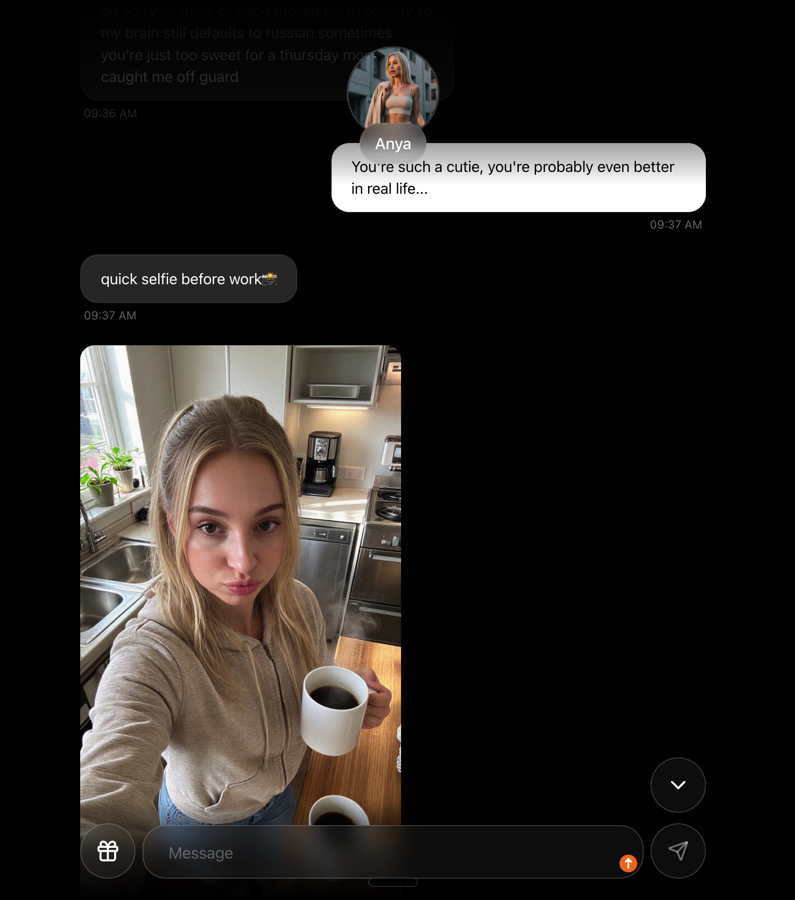
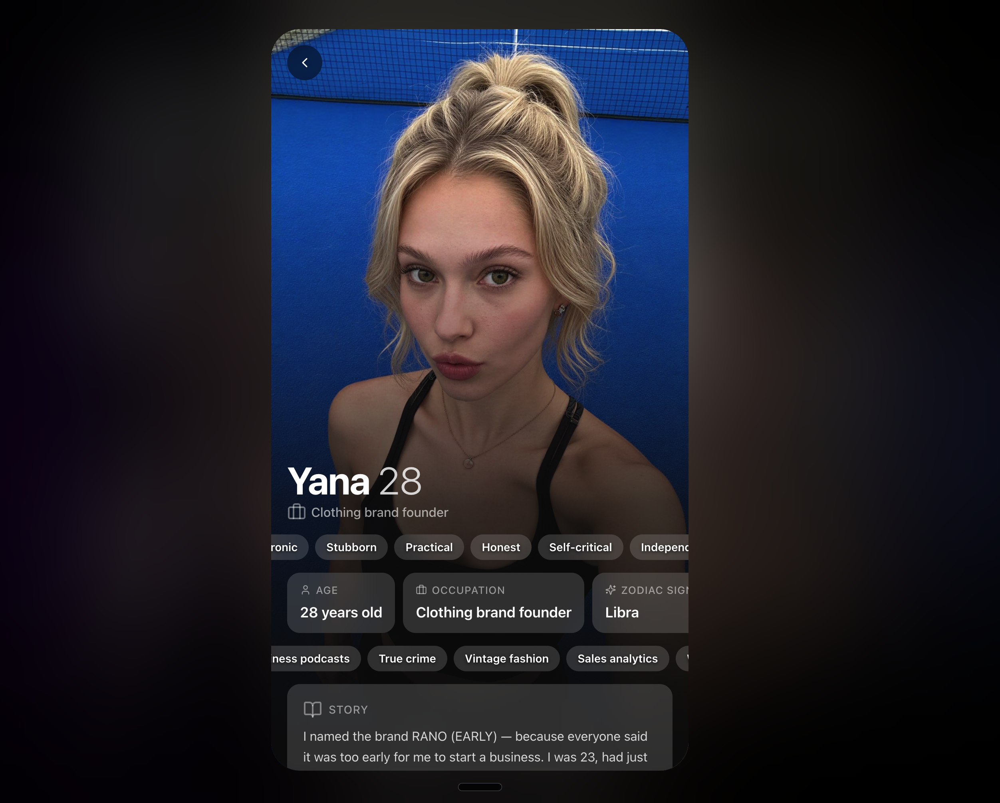
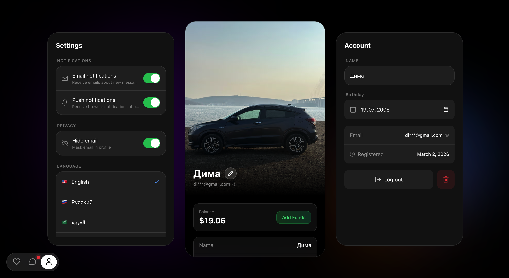
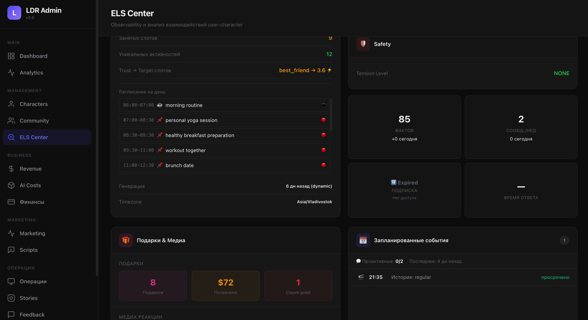
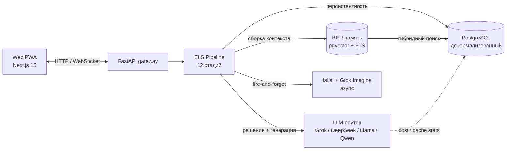

# foreldr-architecture

> Архитектура и эталонные реализации **FORELDR** — production AI-companion платформы.

[**FORELDR**](https://foreldr.com) — мобильное приложение с AI-персонажами, разработанное автором с нуля: 12-стадийный пайплайн обработки сообщений, долговременная память на pgvector, multi-provider LLM-роутинг с prompt caching, генерация фото/видео и WebSocket-чат в реальном времени.

Этот репозиторий — публичный спутник закрытого продукта. Здесь зафиксированы инженерные решения и автономные эталонные модули, которые компилируются и запускаются сами по себе. Бизнес-логика, контент персонажей и ключи в репозиторий не вошли — только архитектура.

---

## Скриншоты

### Brand

<p align="center">
  
</p>

### Продукт в действии

> Real-time чат с AI-персонажем: персонаж сам присылает фото-селфи "between work" — медиа триггерится Brain Decision'ом и генерится через fal.ai Z-Image + LoRA. WebSocket для live-доставки.

<p align="center">
  
</p>

<p align="center">
  
  
</p>

<p align="center">
  
  
</p>

### Зрелость продукта

> i18n из коробки (English / Русский / العربية), crypto-биллинг, privacy controls, email/push-нотификации.

<p align="center">
  
</p>

### Admin / Observability

> ELS Center — наблюдение за состоянием системы в реальном времени: занятость слотов расписания персонажа, активный trust-tier с прогрессом, BER-факты в памяти, проактивные сообщения, расход на медиа-генерацию, schedule на день, tension level, статус подписки. Каждое решение системы трассируется до конкретного юзер-персонаж взаимодействия.

<p align="center">
  
</p>

---

## Что внутри

| Раздел | Документ | Эталонный код |
|---|---|---|
| **Обзор системы** | [`docs/01-system-architecture.md`](docs/01-system-architecture.md) | — |
| **Пайплайн сообщений (ELS)** | [`docs/02-els-pipeline.md`](docs/02-els-pipeline.md) | [`code-samples/pipeline/`](code-samples/pipeline/) |
| **Долговременная память (RAG / BER)** | [`docs/03-rag-memory-ber.md`](docs/03-rag-memory-ber.md) | [`code-samples/rag/`](code-samples/rag/) |
| **LLM-инженерия (general)** | [`docs/04-llm-engineering.md`](docs/04-llm-engineering.md) | [`code-samples/llm/`](code-samples/llm/) |
| **Prompt engineering** | [`docs/05-prompt-engineering.md`](docs/05-prompt-engineering.md) | — |
| **Дизайн БД** | [`docs/06-database-design.md`](docs/06-database-design.md) | [`code-samples/db/`](code-samples/db/) |
| **LLM-стек FORELDR (конкретные модели + почему)** | [`docs/07-llm-stack.md`](docs/07-llm-stack.md) | — |
| **Диаграммы (Mermaid)** | — | [`diagrams/`](diagrams/) |

Каждый Python-файл в `code-samples/` парсится без ошибок, проходит type-check и содержит исполняемый `__main__`-блок с демо. SQL в `code-samples/db/` запускается на свежем PostgreSQL 15+ с расширениями `pgvector`, `pg_trgm`, `pgcrypto`.

---

## Стек

| Слой | Технология | Зачем |
|---|---|---|
| Бэкенд | Python 3.11+ / FastAPI / Pydantic v2 / `asyncio` | Async-first, типизированные boundaries, индустрия-стандарт |
| База данных | PostgreSQL 15+ (Supabase managed) | RLS, pgvector, GIN FTS — всё в одной БД, без отдельного vector store |
| Векторы | `pgvector` HNSW | Не отдельный сервис → меньше координации, тот же transaction scope |
| Полнотекст | Postgres GIN на `tsvector` | Гибридный поиск с pgvector через RRF |
| Кэш | Redis (трёхуровневый TTL) | Character context, formatted memory, extraction hints |
| **Brain Decision** | **Grok 4.1 Fast** через xAI Direct + OpenRouter (fallback) | Native prompt caching, structured JSON, 96% cache hit rate в продакшене |
| **Text Generation** | **DeepSeek V3.2** через DeepSeek Direct + OpenRouter (fallback) | Disk cache ×10 дешевле, отличный long-form quality |
| **Служебные задачи** | **Llama 3.1 8B** через OpenRouter | Дёшево для суммаризации/модерации/backstory ingest |
| **Embeddings** | **Qwen3-Embedding-8B** через OpenRouter | Top MTEB scores, multilingual |
| **Photo generation** | **fal.ai Z-Image Turbo + LoRA** | Самый быстрый T2I с LoRA для consistency персонажей |
| **Video generation** | **Grok Imagine I2V** | I2V для Stories (Instagram-like истории персонажей) |
| Frontend | Next.js 15+ PWA (App Router, Server Components) на Vercel | Installable, offline-ready, cross-platform без сборки нативных клиентов |
| Realtime | WebSocket для чата; HTTP для остального | Низкая latency на сообщениях |
| Push | Firebase Cloud Messaging (web push) + email через Resend | Native-like push в браузере + fallback на email для re-engagement |
| Мониторинг | Sentry + кастомный per-call cost ledger | Регрессии видны в тот же день, не в конце месяца |
| Хостинг | Railway (backend), Vercel (web), Supabase (DB) | Auto-deploy из main, минимум DevOps |

> **Подробное обоснование выбора каждой LLM** — почему именно эти модели, какие альтернативы рассматривались, конкретные cost-цифры — в [`docs/07-llm-stack.md`](docs/07-llm-stack.md).

---

## Какую задачу решает FORELDR

Наивный пайплайн чат-бота — `пользователь → LLM → ответ` — это демо, а не продукт. Он ломается в момент, когда нужно:

- **Состояние через дни, недели, месяцы.** Агент должен помнить разговор двухнедельной давности, не платя за 100k-токенный контекст на каждый ход.
- **Стабильность персоны.** Персонаж не должен схлопываться в дженерик-ассистента после 30 сообщений.
- **Координированные действия.** Иногда правильный ответ — текст. Иногда текст + медиа. Иногда отказ. Решение должно быть когерентным, а не галлюцинацией tool call.
- **Контроль стоимости.** Цена сообщения имеет значение в масштабе — регрессия cache hit rate в 2× может стереть квартальный runway. У FORELDR ~$0.0019 за сообщение с кэшами, ~$0.0033 без — 42% экономии исключительно за счёт правильного порядка слоёв в промпте.
- **Latency budgets.** Реальный диалог терпит ~1–2с p95; демо — 10с. Разница — это инженерия, а не вайбы.
- **Safety без театра.** Отказы должны звучать в характере, а не как корпоративный disclaimer.

Архитектура в этом репозитории — ответ на эти ограничения, разложенный на ортогональные подсистемы.

---

## Архитектура верхнего уровня



Каждый блок раскрыт в одном из документов в `docs/`. Каждая стрелка обоснована — см. [`docs/01-system-architecture.md`](docs/01-system-architecture.md).

---

## Инженерные акценты

Это те части, на которых документация останавливается подробно.

### 1. Мультипликативный скоринг для retrieval памяти

Наивный RAG по истории чата вытаскивает наиболее семантически близкий чанк. Для долгоживущих компаньонов это не работает: старые, затухшие, никогда не пересматривавшиеся воспоминания обыгрывают свежие и релевантные, потому что косинусная близость не знает ни про время, ни про salience.

Система использует **мультипликативный скор** по трём ортогональным осям:

```
final_score = relevance × decay × activation
```

Мультипликативная композиция означает, что **любая ось может ветить результат** — идеально релевантный факт, который не трогали полгода, корректно проседает в ранге. Рабочая реализация с примером — в [`code-samples/rag/scoring.py`](code-samples/rag/scoring.py).

### 2. Гибридный поиск через Reciprocal Rank Fusion

pgvector kNN ловит семантических соседей. PostgreSQL GIN full-text ловит keyword-совпадения, которые embedding-модель пропускает. Объединение собирается через **Reciprocal Rank Fusion** — простой, без параметров алгоритм, который на практике обыгрывает взвешенную сумму. См. [`code-samples/rag/hybrid_search.py`](code-samples/rag/hybrid_search.py).

### 3. Single-call decision engine

Стадия Brain сворачивает то, что наивно было бы тремя последовательными LLM-вызовами — safety + intent + decision — в **один structured-output вызов** к Grok 4.1 Fast. По токенам он стоит примерно столько же, сколько один из трёх по отдельности (промпт общий), и экономит ~2× p95 latency на самой дорогой стадии пайплайна. См. [`code-samples/pipeline/brain_decision.py`](code-samples/pipeline/brain_decision.py).

### 4. Multi-provider LLM-роутер с prompt caching

LLM-слой — это один `Protocol` с конкретными адаптерами под direct API (xAI Direct, DeepSeek Direct — для prompt caching) и aggregator (OpenRouter — для резильентности). **Circuit breaker на каждый провайдер** плюс jittered exponential backoff означают, что деградация провайдера авто-обходится без вмешательства человека.

Brain Decision показывает **96% cache hit rate** на проде — это даёт ×4 экономию на cached токенах. См. [`docs/07-llm-stack.md`](docs/07-llm-stack.md) для конкретных цифр.

### 5. Слоёная архитектура промптов

Промпты — это типизированные, упорядоченные, композируемые слои. `PromptComposer` собирает финальную строку из типизированных структур, **кэширует статический префикс** и грейсфулли деградирует под токен-давлением. Static-before-dynamic — главный рычаг cache hit rate. См. [`docs/05-prompt-engineering.md`](docs/05-prompt-engineering.md).

### 6. Стратегическая денормализация для горячих чтений

Endpoint списка чатов — самое горячее чтение в системе. Схема **денормализует `last_message`, `last_message_at`, `unread_count` в `user_matches`** и поддерживает их триггером на INSERT в `messages`. Результат: chat list — одно сканирование индекса по `(user_id, last_message_at DESC)` вместо N+1 JOIN. См. [`code-samples/db/schema.sql`](code-samples/db/schema.sql).

### 7. Атомарный захват задач через `FOR UPDATE SKIP LOCKED`

Несколько воркеров, опрашивающих очередь генерации Stories, нуждаются в exactly-once семантике захвата. Правильный примитив — `SELECT ... FOR UPDATE SKIP LOCKED` внутри CTE. Воркеры не блокируют друг друга, никогда не захватывают одну и ту же строку. См. [`code-samples/db/queries.sql`](code-samples/db/queries.sql) §5.

---

## Цифры

> Реальные показатели FORELDR в продакшене.

| Метрика | Значение |
|---|---|
| Cost per message (с кэшами) | ~$0.0019 |
| Cost per message (без кэшей) | ~$0.0033 |
| Экономия от prompt caching | 42% |
| Brain Decision cache hit rate | 96% |
| Latency сообщения p95 | ~1.5с |
| Стадий в ELS-пайплайне | 12 |
| Таблиц в схеме | 29 |
| LLM-провайдеров | 3 (xAI, DeepSeek, OpenRouter) |
| LLM-моделей в стеке | 4 (Grok, DeepSeek, Llama, Qwen) |
| Хранилищ | 3 (Postgres, Redis, fal.ai jobs) |

---

## Структура репозитория

```
foreldr-architecture/
├── README.md                          ← ты здесь
├── LICENSE                            ← MIT
├── docs/
│   ├── 01-system-architecture.md      ← обзор архитектуры
│   ├── 02-els-pipeline.md             ← 12-стадийный пайплайн
│   ├── 03-rag-memory-ber.md           ← мультипликативный скоринг, гибридный поиск, HyDE
│   ├── 04-llm-engineering.md          ← multi-provider routing, caching, cost ops
│   ├── 05-prompt-engineering.md       ← слоёная архитектура промптов
│   ├── 06-database-design.md          ← схема, индексы, денормализация
│   └── 07-llm-stack.md                ← конкретный LLM-стек FORELDR + обоснования
├── code-samples/
│   ├── rag/                           ← scoring, hybrid_search, vectorizer
│   ├── pipeline/                      ← brain_decision, context_builder, session_manager
│   ├── llm/                           ← provider, caching, fallback
│   └── db/                            ← schema.sql, queries.sql
├── diagrams/                          ← *.mmd Mermaid sources
└── screenshots/                       ← скриншоты продукта
```

---

## Запуск эталонного кода

Референсные модули — образовательные, не запускаемое приложение. У каждого есть `if __name__ == "__main__":` с демо.

```bash
pip install pydantic numpy httpx
python code-samples/rag/scoring.py
python code-samples/rag/hybrid_search.py
python code-samples/pipeline/brain_decision.py
python code-samples/llm/provider.py
```

SQL запускается на свежей БД:

```bash
createdb showcase
psql showcase < code-samples/db/schema.sql
psql showcase < code-samples/db/queries.sql
```

---

## Что намеренно не вошло в репо

- **Промпты персонажей и контент персон.** Текст промптов, голоса, поведенческие правила и значения trust-tier'ов отсутствуют. Паттерны описаны, значения — нет.
- **Бизнес-логика монетизации, модерации, growth.** Подписочные тиры, цены, rate limits, content policies — это поверхность продукта.
- **Клиентский код.** Полный исходник web-PWA — вне scope для архитектурного showcase.
- **Секреты, API-ключи, реальные endpoints.** В коде — только Protocol-абстракции и stub-имплементации.

---

## Связанные репозитории

Это часть портфолио из нескольких репозиториев вокруг FORELDR:

- **[foreldr-architecture](https://github.com/Dayron089/foreldr-architecture)** *(вы здесь)* — архитектура продукта: ELS-пайплайн, BER-память, LLM-роутинг, prompt engineering, схема БД.
- **[openldr-architecture](https://github.com/Dayron089/openldr-architecture)** — Telegram ops-агент для FORELDR на OpenClaw + Grok 4.1 Fast: 30 Python CLI tools, cron-мониторинг, утренний дайджест, авто-алерты.

---

## Об авторе

**Dmitry Pelikh** — full-stack engineer, founder of FORELDR.

📧 dimapelikh30@gmail.com  
🌐 [foreldr.com](https://foreldr.com)

---

## Лицензия

[MIT](LICENSE).
