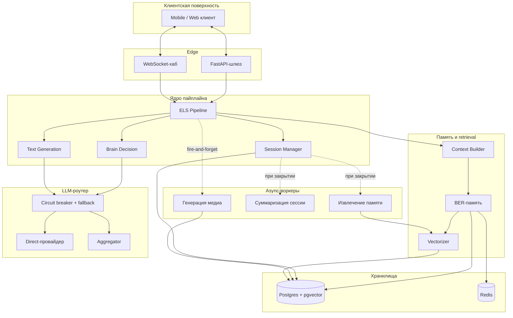

# Архитектура системы FORELDR

Этот документ — высокоуровневая ориентация в архитектуре FORELDR. Он отвечает на три вопроса: какие подсистемы существуют, как они общаются и где реально живёт нагрузка. Каждое утверждение здесь раскрыто в одном из глубоких документов.

---

## 1. Подсистемы вкратце

Приложение разложено на семь ортогональных подсистем. У каждой свои данные, свои failure modes и свой latency budget. Межподсистемная координация — явная, никогда неявная.

| Подсистема | Зона ответственности | Latency budget (p95) | Деталь |
|---|---|---|---|
| **API-шлюз** | Auth, rate limiting, маршрутизация запросов, WebSocket lifecycle | <50ms (без хэндлера) | — |
| **ELS-пайплайн** | 12-стадийный пайплайн обработки сообщений | 1.0–1.8s | [02](02-els-pipeline.md) |
| **BER-память** | Долговременная семантическая память, retrieval, скоринг | <120ms (retrieval) | [03](03-rag-memory-ber.md) |
| **LLM-роутер** | Multi-provider абстракция, caching, fallback, атрибуция стоимости | provider-bound | [04](04-llm-engineering.md) |
| **Prompt composer** | Типизированная слоёная сборка промптов с cache-aware упорядочиванием | <5ms | [05](05-prompt-engineering.md) |
| **Персистентность** | Схема PostgreSQL, индексы, триггеры, RLS | <30ms (горячие чтения) | [06](06-database-design.md) |
| **Генерация медиа** | Async-задачи изображения/видео с polling статуса | секунды → минуты (async) | — |

---

## 2. Большая картина

Сплошные стрелки — sync. Пунктирные — async / fire-and-forget. Форма этого графа — самое важное в этом документе: он маленький, рёбра типизированы, и нет неявных связей между подсистемами.

---

## 3. Жизненный цикл запроса (happy path)

Сообщение пользователя проходит следующий путь. Номера стадий соответствуют [02-els-pipeline](02-els-pipeline.md).

1. **Приём** на WebSocket-хабе. Auth и rate-limit проверяются выше, на шлюзе.
2. **Запись** сообщения пользователя сразу (write-ahead). Если что-то ниже по пайплайну упадёт, история разговора цела.
3. **Сборка контекста** — параллельно тянутся последние сообщения, релевантная память из BER, состояние расписания и rapport. У каждого fetcher'а свой timeout; частичный сбой деградирует грейсфулли.
4. **Brain decision** — один LLM-вызов возвращает `{safety, intent, action, thought}` структурированным JSON. Это самый дорогой вызов на пути, поэтому он работает за троих.
5. **Маршрутизация** по решению: text-only, text + media или отказ.
6. **Генерация** ответа моделью класса generation с cache-friendly слоёным промптом.
7. **Доставка** ответа обратно через WebSocket; запрос закрывается.
8. **Фоновая работа** — при закрытии сессии запускаются извлечение памяти и суммаризация. Они никогда не блокируют пользователя.

p95-budget на шаги 1–7 — ~1.5с. Шаг 4 обычно доминирует; шаг 6 — на втором месте.

---

## 4. Где живёт нагрузка

Три места в порядке давления:

1. **LLM-роутер.** Каждое сообщение — это минимум один вызов (Brain) и обычно два (Brain + генерация). Это самая большая cost-line и самый большой вклад в latency. Каждая оптимизация в [04-llm-engineering](04-llm-engineering.md) обоснована именно этим фактом.

2. **Запрос chat list.** Самое частое чтение в системе — каждый открытие приложения попадает в него, плюс рефреши push-уведомлений. По этой причине `user_matches` несёт денормализованные `last_message`, `last_message_at`, `unread_count`, поддерживаемые триггером. Без этого — N+1 JOIN. С этим — одно сканирование индекса.

3. **Retrieval памяти.** Каждый Brain-вызов хочет релевантных воспоминаний. Гибридный поиск (pgvector kNN + FTS, fused через RRF) плюс Redis-кэш «отформатированного контекста» держат p95 retrieval'а под ~120ms даже на миллионах строк памяти.

Всё остальное — ниже шумового порога.

---

## 5. Изоляция отказов

Система построена на предположении, что **каждая внешняя зависимость упадёт** — провайдеры деградируют, регионы выпадают, очереди забиваются. Failure model — явная:

| Если падает… | Система… |
|---|---|
| Direct LLM-провайдер | Откатывается на агрегатор (circuit breaker на провайдер) |
| Оба LLM-провайдера | Возвращает грейсфул "сейчас не получается" + ничего не персистится так, будто всё ОК |
| BER retrieval | Деградирует до контекста только из последних сообщений; логирует промах |
| Redis | Пропускает кэш; всё работает, просто медленнее и дороже |
| Генерация медиа | Возвращает text-only ответ; показывает индикатор "ваше изображение обрабатывается" |
| Postgres primary | Hard fail — грейсфул-пути нет; это граница durability |

Единственная неснижаемая зависимость — primary база. У всего остального есть определённый fallback.

---

## 6. Observability

Что измеряется per-request:

- **Trace ID** — пробрасывается через каждую стадию; перетаскивается в фоновые задачи, спавнящиеся запросом.
- **Per-stage timing** — записывается в response object, светится на `/admin/costs`.
- **Per-call LLM cost** — токены in / out / cached / провайдер / модель / latency, атрибутируется на `(user_id, character_id, stage)`.
- **Cache hit rate** — на провайдер и на модель, real-time.
- **Error rate by class** — provider 5xx, validation failure, retrieval miss и т. д.

На что есть алерты:

- Регрессия p95 latency на любой стадии
- Регрессия cache hit rate (сигнал, что изменение промпта сломало префикс)
- Спайк ошибок одного провайдера (сигнал, что должен сработать fallback)
- Зависшие async-задачи старше порога (reaper'ятся cron-сингтоном через advisory lock)

---

## 7. Эвристики дизайна, которые видны везде

Это неявные правила, которым следует система. Их стоит назвать — потому что они объясняют многие неочевидные выборы в более глубоких документах.

1. **Композиция через Protocols, а не конкретные классы.** Каждая внешняя зависимость — LLM-провайдер, embedding-модель, vector backend, full-text backend, memory store — это `Protocol`. Конкретные реализации инжектятся. Именно это позволяет референсным сэмплам в этом репо работать в изоляции, и это та же форма, что использует продакшен-код.

2. **Идемпотентность везде.** Закрытие сессии, персистенс сообщения, извлечение памяти — всё идемпотентно. Это делает retry безопасным, что делает fallback-слой дешёвым, что делает систему резильентной.

3. **Fire-and-forget для неблокирующей работы.** Всё, что не влияет на ответ на проводе, работает в фоне. Пользователь не ждёт извлечения памяти.

4. **Static before dynamic — везде.** Промпты: статичные слои первыми ради кэша префикса. БД: foreign-key колонки с лидирующими индексами. Retrieval: дешёвые фильтры до дорогого скоринга.

5. **Мультипликативная композиция вместо аддитивной.** Скоринг памяти — `relevance × decay × activation`, не `α·R + β·D + γ·A`. Умножение позволяет любой оси заветить результат, что соответствует реальной семантике — 6-месячный факт не «на 80% так же хорош» как 1-дневный, он *категорически менее полезен*, если только не более релевантен.

6. **Стоимость — first-class метрика.** Каждый LLM-вызов попадает в per-call ledger по ключу `(user_id, character_id, stage, provider, model)`. Регрессии стоимости видны в тот же день, а не в конце месяца.

7. **Границы типизированы.** Pydantic v2 на каждой границе подсистемы. Внутренняя связь — через Protocols. Никаких неявных `dict`, текущих между слоями.

---

## 8. Что дальше в документации

Если читать по порядку:

1. [`02-els-pipeline.md`](02-els-pipeline.md) — пайплайн обработки сообщений в деталях.
2. [`03-rag-memory-ber.md`](03-rag-memory-ber.md) — подсистема памяти.
3. [`04-llm-engineering.md`](04-llm-engineering.md) — LLM-роутер.
4. [`05-prompt-engineering.md`](05-prompt-engineering.md) — prompt composer.
5. [`06-database-design.md`](06-database-design.md) — слой персистентности.

Каждый документ самодостаточен. У каждого свои диаграммы, и каждый ссылается на запускаемый код в [`code-samples/`](../code-samples/).
