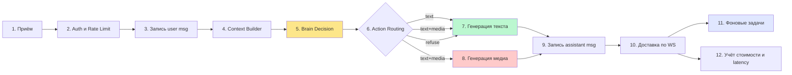
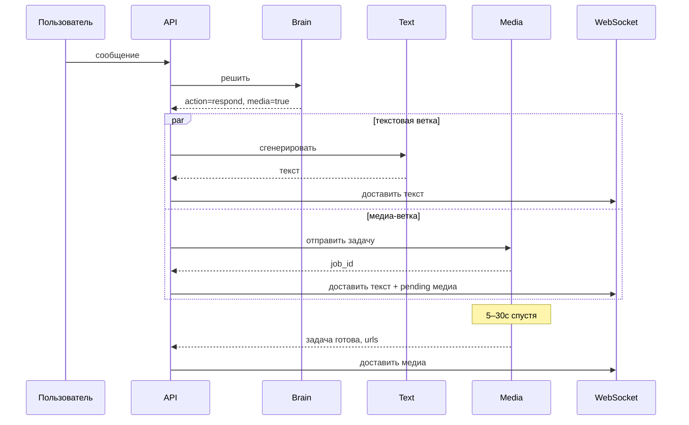

# Пайплайн ELS — архитектура stateful-обработки сообщений для persona-driven LLM-агентов

> **ELS — Emulating Life System.** Пайплайн обработки сообщений из 12 этапов, спроектированный для stateful AI-компаньонов с устойчивой личностью, где наивные паттерны request/response перестают работать.

---

## 1. Постановка задачи

Наивный LLM-чатбот выглядит примерно так:

```
user_message → llm.complete(system_prompt + history + user_message) → assistant_message
```

Этого хватает для stateless single-turn ассистентов. Этого категорически не хватает для долгоживущего персонажа-компаньона. В продакшене наивный пайплайн молча ломается минимум по семи осям:

| Сбой | Симптом в наивном пайплайне | Цена игнорирования |
|---|---|---|
| **Дрейф персонажа** | Модель перефразирует system prompt, постепенно теряя голос между ходами. | Пользователи отваливаются за дни; продукт ощущается как "ещё один чатбот". |
| **Амнезия памяти** | Контекстное окно заполняется, старые ходы вытесняются, модель забывает стабильные факты о пользователе. | Компаньон спрашивает имя пользователя на 30-й день. |
| **Несогласованность расписания** | Компаньон утверждает, что "на работе" в 3 ночи, потому что нет понятия времени суток. | Suspension of disbelief разрушается. |
| **Неоднозначность действий** | Текущий ход — это текст? Текст + картинка? Отказ? Модель решает свободно и противоречит себе в одном ответе. | Текст в стиле подписи уходит без картинки; либо отказ зашит в ход с прикреплённым медиа. |
| **Несогласованность safety** | Фильтры запускаются после генерации; отфильтрованный вывод стоит полной токен-цены и приводит к видимому "rejected" UX. | Дороже, хуже UX, регуляторные риски. |
| **Налог на latency** | Каждый вызов safety / intent / action — отдельный round-trip к LLM. p95 уходит в несколько секунд. | Пользователи воспринимают компаньона как "слишком долго думает". |
| **Взрыв стоимости** | Каждый ход переотправляет полный system prompt и историю без какой-либо стратегии кэширования. | $0.02–0.05 за сообщение на масштабе. |

ELS — это архитектурный ответ. Работа разбита на 12 этапов с явными входами, выходами, лимитами времени и режимами отказа. Часть этапов — на LLM; большинство — нет.

---

## 2. Обзор пайплайна



Цвета отражают операционные роли:
- **Жёлтый (Brain Decision):** единственный LLM-вызов, определяющий, что произойдёт на этом ходу.
- **Зелёный (Генерация текста):** второй LLM-вызов, который порождает видимый пользователю текст.
- **Красный (Генерация медиа):** асинхронный, может упасть, не ломая ход.
- **Индиго (Background):** fire-and-forget работа; никогда не блокирует ответ.

Все остальные этапы — без LLM: in-process логика, чтение из БД, запрос в Redis или сетевая запись клиенту.

Типичный happy-path ход содержит ровно **два LLM-вызова** (Brain + Text). Медиа добавляет третий асинхронный воркфлоу, который не блокирует текстовый ответ.

---

## 3. Поэтапный разбор

Каждый этап описан как: **Назначение · Входы · Выходы · Лимит времени · Режим отказа.**

### Этап 1 — Приём сообщения

**Назначение.** Принять входящее сообщение пользователя через HTTP POST или фрейм долгоживущего WebSocket.

**Входы.** Сырое HTTP-тело или текстовый фрейм WebSocket; bearer-токен; client trace ID (опционально).

**Выходы.** Нормализованная Pydantic-модель `IncomingMessage` с `user_id` (получен после auth), `character_id`, `text`, `client_msg_id` (ключ идемпотентности), `received_at`.

**Лимит времени.** < 5 мс.

**Режим отказа.** Битые тела отвергаются с 400. Идемпотентность по `client_msg_id` — ретраи на флапающей мобильной сети не должны порождать дубликаты ходов.

> WebSocket и HTTP оба питают один и тот же внутренний пайплайн. Разница транспортов — только в доставке. Любое ветвление по транспорту выше этого слоя — code smell.

### Этап 2 — Auth и Rate Limit

**Назначение.** Аутентифицировать вызывающего, применить квоты per-user и per-endpoint до любой дорогостоящей работы.

**Входы.** JWT bearer-токен, user ID, идентификатор маршрута.

**Выходы.** Аутентифицированный объект `User` или 401 / 429.

**Лимит времени.** < 10 мс (верификация токена кэшируется, счётчик rate limit в Redis).

**Режим отказа.** Невалидный токен → 401. Превышение квоты → 429 с заголовком `Retry-After`. Rate limiter обязан fail-open при падении Redis, чтобы нормальный трафик не зависел жёстко от него, но обязан громко логировать, чтобы оператор это заметил.

Квоты идут слоями:

| Слой | Зачем |
|---|---|
| Per-IP | Блокировать скрейперы и абьюзивных клиентов до user-level проверок. |
| Per-user-per-route | У chat-эндпоинтов другие квоты, чем у admin-эндпоинтов. |
| Per-user-global | Ловить креативный абьюз, размазанный по разным маршрутам. |
| Per-LLM-provider | Не сжигать бюджет ради одного пользователя; отвергать его запрос, а не всех остальных. |

Per-provider лимит применяется внутри LLM-клиента, а не на API-edge. См. [04-llm-engineering.md](./04-llm-engineering.md).

### Этап 3 — Запись user-сообщения (write-ahead)

**Назначение.** Надёжно зафиксировать пользовательское сообщение **до** любой LLM-работы. Если пайплайн падает посередине, диалог восстановим.

**Входы.** `IncomingMessage`, ID сессии, sequence number.

**Выходы.** `MessageRow` записан в primary store с `id`, `created_at`.

**Лимит времени.** < 30 мс.

**Режим отказа.** Сбой записи в БД роняет ход с 503. Это единственный этап, который синхронно роняет ход целиком — всё, что ниже по потоку, имеет graceful degradation.

Этот write-ahead не обсуждается. Пайплайн, который сначала зовёт LLM и только потом пишет, под нагрузкой будет терять диалоги во время частичных аварий.

### Этап 4 — Context Builder

**Назначение.** Собрать входы, нужные остальной части пайплайна. Это оркестрация конкурентного IO.

**Входы.** `user_id`, `character_id`, `session_id`, хвост последних сообщений.

**Выходы.** `ContextPackage`:

```python
class ContextPackage(BaseModel):
    recent_messages: list[Message]      # хвост текущей сессии
    retrieved_memories: list[Memory]    # долговременные факты, поднятые векторным поиском
    schedule_state: ScheduleState       # что персонаж "делает" прямо сейчас
    trust_state: TrustState             # маркер прогрессии для пары user/persona
    time_context: TimeContext           # локальное время, день недели, "утро"/"поздняя ночь"
    persona_essence: PersonaEssence     # неизменные черты персонажа
```

**Лимит времени.** < 120 мс p95.

**Режим отказа.** Каждый fetcher работает по принципу fire-and-degrade:
- Чтение памяти упало → пустой список, warning в лог, продолжаем.
- Чтение расписания упало → fallback на дефолт "доступен", warning в лог, продолжаем.
- Чтение trust упало → консервативный дефолт (нижний уровень), продолжаем.

> Принцип: **ответ обязан уйти всегда**, даже если он чуть менее персонализирован. Падение чтения памяти невидимо пользователю; падение хода — видимо.

Все fetcher'ы работают конкурентно через `asyncio.gather` с per-fetcher таймаутами. Эталонную реализацию см. в [`code-samples/pipeline/context_builder.py`](../code-samples/pipeline/context_builder.py).

### Этап 5 — Brain Decision (унификация)

**Назначение.** Один LLM-вызов, решающий, что делать на этом ходу: вердикт safety, intent пользователя и выбор действия — всё в одном structured-output ответе.

**Входы.** `ContextPackage`, новое сообщение пользователя, голос и ограничения персонажа.

**Выходы.** `BrainOutput`:

```python
class BrainOutput(BaseModel):
    safety: SafetyFlags          # nsfw, manipulation, aggression, extreme_risk
    intent: Intent               # chat | question | media_request | emotional | flirt
    action: Literal["respond", "deflect", "refuse"]
    mood: Literal["warm", "playful", "casual", "empathetic"]
    media_requested: bool
    requested_media_type: str | None
    needs_memory_context: bool   # подсказка text-этапу, какие секции промпта включать
    needs_schedule_context: bool
    thought: str                 # короткое обоснование, используется как guardrail для text-этапа
    confidence: float
```

**Лимит времени.** < 800 мс p95.

**Режим отказа.** Три слоя защиты:

1. **Schema-валидация** JSON от модели. При ошибке парсинга — один retry со строгим промптом.
2. **Fallback-решение**, если оба попытки провалились: `action="respond"`, intent="chat", все safety-флаги False, консервативный mood. Диалог продолжается со сниженной персонализацией, а не падает.
3. **Provider fallback.** Если первичный провайдер лежит, второй провайдер берёт работу на себя (см. раздел 7).

#### Зачем объединять safety + intent + decision в один вызов?

Большинство пайплайнов гоняют это как три отдельных LLM-вызова. Объединение оказалось самым крупным выигрышем в этой архитектуре.

| Метрика | 3 отдельных вызова | 1 объединённый вызов |
|---|---|---|
| **Round-trip'ы** | 3 | 1 |
| **Стоимость system prompt'а** | ×3 повтора | ×1 |
| **Согласованность** | 3 независимых решения, могут не сойтись | 1 целостный вердикт |
| **Latency** | сумма трёх p95 | один p95 |
| **Расход токенов на ход** | ~×3 от одного safety-промпта | ~×1.2 от одного safety-промпта |

Модель действительно умеет делать всё три задачи одновременно, если ей дать жёсткую JSON-схему и сфокусированный промпт (~200 токенов system-текста). Разделение было legacy-артефактом из эпохи, когда промпты были крупнее.

Trade-off: архитектура с одним вызовом **обязана** иметь жёсткую JSON-schema валидацию и детерминированный fallback. Иначе битый ответ сломает три ответственности разом. Политика retry + fallback на этапе 5 — плата за вход.

### Этап 6 — Action Routing

**Назначение.** Ветвление по `BrainOutput.action`.

**Входы.** `BrainOutput`.

**Выходы.** `TextOrder` (всегда) и опционально `MediaOrder`.

**Лимит времени.** < 1 мс (in-process).

**Режим отказа.** Нет — чистая логика. Защитные дефолты: неизвестный action → `respond`.

```python
match brain.action:
    case "respond":
        text_order = TextOrder.from_brain(brain)
        media_order = MediaOrder.from_brain(brain) if brain.media_requested else None
    case "deflect":
        text_order = TextOrder.deflect(brain)
        media_order = None
    case "refuse":
        text_order = TextOrder.refuse(brain)
        media_order = None
```

Refuse и deflect маршрутизируются **через тот же text-этап**, что и обычные ответы. Персонаж сохраняет голос, отказывая. Отдельного "шаблона отказа" нет — он создавал бы заметную развилку в тональности.

### Этап 7 — Генерация текста

**Назначение.** Произвести видимый пользователю текстовый ответ через LLM, заточенную под генерацию.

**Входы.** `TextOrder`, `ContextPackage`, промпт персонажа.

**Выходы.** `TextResponse(content, mood, finish_reason)`.

**Лимит времени.** < 1500 мс p95.

**Режим отказа.**
- Провайдер вернул 5xx → fallback-провайдер с тем же промптом.
- Пустой контент → один retry, затем tone-appropriate извинение.
- В выводе обнаружен паттерн отказа (некоторые модели иногда инжектят hardcoded refusal даже на безобидном промпте) → retry с подталкивающим промптом или fallback на шаблонный ответ, согласованный с голосом персонажа.

Тонкий момент: text-генерация получает `BrainOutput.thought` в составе своего system prompt. Это "guardrail-мост" — Brain (принимающий решение) и Text (пишущий) — это разные модели, но Text заземляется на рассуждение Brain, чтобы оба оставались согласованными.

### Этап 8 — Генерация медиа (асинхронная полоса)

**Назначение.** Сгенерировать изображение или короткое видео, когда присутствует `MediaOrder`.

**Входы.** `MediaOrder` с промптом, типом, референсом персонажа.

**Выходы.** `MediaJob(job_id, status, urls)` — обычно резолвится за несколько циклов поллинга.

**Лимит времени.** Синхронная часть < 100 мс (отправка задачи). Резолвинг: 5–30 с для картинок, 30–90 с для видео.

**Режим отказа.** **Критично: падение медиа никогда не должно ломать текстовый ответ.** Текстовый ответ уходит немедленно. Медиа-задача трекается отдельно и доставляется через WebSocket по готовности. Если медиа-задача терминально упала, текстовый ответ уже ушёл; пользователь видит уведомление "media unavailable" или персонаж делает мягкий отыграж в следующем ходу.



### Этап 9 — Запись (assistant-сообщение)

**Назначение.** Записать ход ассистента в primary store.

**Входы.** `TextResponse`, опциональная ссылка на `MediaJob`, сессия, mood, finish reason.

**Выходы.** Persisted message row, обновлённые метаданные сессии.

**Лимит времени.** < 30 мс.

**Режим отказа.** Сбой записи здесь громко логируется, но **не** откатывает доставку. Пользователь уже увидел ответ через WebSocket; откатывать его хуже, чем оставить orphan in-memory state. Сессия помечается dirty, и reconciliation job её залечивает.

### Этап 10 — Доставка по WebSocket

**Назначение.** Запушить текстовый ответ всем подключённым клиентам пользователя.

**Входы.** `TextResponse`, опциональный placeholder media event.

**Выходы.** Фрейм записан в WebSocket, ack собран, если протокол это поддерживает.

**Лимит времени.** < 20 мс с момента, как объект ответа уже на руках.

**Режим отказа.** WebSocket отвалился → fallback на push-уведомление + дозабор при следующем открытии сессии. Ответ уже сохранён на этапе 9, поэтому ничего не теряется.

### Этап 11 — Фоновые задачи (fire-and-forget)

Выполняются после доставки ответа на background-воркерах, никогда не блокируя пользователя.

| Задача | Триггер | Назначение |
|---|---|---|
| Извлечение памяти (BER) | Закрытие сессии (N минут idle) | Прочитать недавние ходы, извлечь устойчивые факты, эмбеддить и записать в vector store. |
| Суммаризация сессии | Закрытие сессии | Сгенерировать короткий recap для будущего контекста. |
| Обновление расписания | По времени или событию | Продвинуть день персонажа. |
| Прогрессия trust | После каждого хода | Обновить счётчики отношений. |
| Reaper-задачи | Cron | Резолвить зависшие медиа-задачи, экспайрить устаревшие сессии. |

Ключевое правило дизайна: **извлечение памяти не real-time.** Делать его на каждом ходу значило бы сжигать третий LLM-вызов на каждое сообщение и часто извлекать шум из in-progress диалогов. Батчинг при закрытии сессии существенно дешевле и даёт качественнее факты, потому что у сессии есть целостная нарративная дуга.

### Этап 12 — Учёт стоимости и latency

**Назначение.** Атрибутировать каждый LLM-вызов, каждый retry, каждое попадание в кэш к породившему его ходу.

**Входы.** Каждый LLM-вызов пишет usage-запись с `user_id`, `character_id`, `stage`, `provider`, `model`, `prompt_tokens`, `completion_tokens`, `cached_tokens`, `latency_ms`, `cost_usd`.

**Выходы.** `usage`-строка на каждый LLM-вызов, агрегированная `turn_metrics`-строка на каждый ход пользователя.

**Лимит времени.** < 5 мс (асинхронная запись, батчингом).

**Режим отказа.** Сбой записи tracking'а никогда не должен влиять на пользователя. Буферизовать локально, retry, дропать при персистентном сбое.

Именно это делает систему наблюдаемой. Без этого регрессия в p95 или 20% всплеск стоимости невидимы до момента, когда придёт счёт.

---

## 4. Async-паттерны

Пайплайн построен вокруг трёх режимов исполнения, используемых осознанно:

### Sequential (нужно ждать)
Этапы 1, 2, 3, 4, 5, 6, 7, 9, 10 идут последовательно по критическому пути, потому что каждый потребляет вывод предыдущего. Полный бюджет критического пути приблизительно:

```
5 + 10 + 30 + 120 + 800 + 1 + 1500 + 30 + 20 ≈ 2.5с p95
```

### Concurrent (gather)
Внутри этапа 4 fetcher'ы идут конкурентно:

```python
recent, memories, schedule, trust = await asyncio.gather(
    fetch_recent_messages(...),
    fetch_memories(...),
    fetch_schedule(...),
    fetch_trust(...),
    return_exceptions=True,
)
```

Возврат исключений вместо raise сохраняет пайплайн живым при частичных сбоях.

### Parallel branches
Этап 7 (текст) и этап 8 (медиа) идут параллельными ветками, когда нужны оба. Ветки сходятся на этапе 10 — текст уходит первым, медиа следом.

### Fire-and-forget
Этапы 11 и 12 — fire-and-forget. Они стартуют *после* `WebSocket.send`, чтобы пользователь никогда их не ждал.

```python
async def handle_turn(...):
    # ... критический путь ...
    await ws.send(text_response)
    asyncio.create_task(record_usage(...))
    asyncio.create_task(maybe_close_and_extract(...))
```

Распространённый баг: забыть удержать сильную ссылку на background-задачи. Задачу может собрать GC до её завершения. Используйте task registry (например, долгоживущий `set[asyncio.Task]` с `done`-коллбэком на удаление) или structured supervisor.

---

## 5. Backpressure и Rate Limiting

Три слоя, каждый применяется в своей точке жизненного цикла запроса:

| Слой | Где | Механизм |
|---|---|---|
| **API edge** | FastAPI middleware | Token bucket per `(user_id, route)` в Redis. |
| **LLM-клиент** | Provider adapter | Per-provider concurrency cap + leaky bucket по RPM-лимитам. |
| **Очередь задач** | Background worker | Максимум одновременных медиа-задач на пользователя. |

Средний слой чаще всего упускают. Без per-provider контроля конкурентности всплеск трафика отправляет тысячи параллельных запросов в LLM, провайдер начинает rate-лимитить, и теперь все получают 429. С контролем конкурентности избыточные запросы выстраиваются локально с deadline; как только deadline истекает — short-circuit на fallback.

---

## 6. Матрица обработки сбоев

| Этап | Сбой | Поведение | Видно пользователю |
|---|---|---|---|
| 1 | Битое тело | 400 | Да |
| 2 | Невалидный токен | 401 | Да |
| 2 | Превышение квоты | 429 | Да (Retry-After) |
| 3 | Сбой записи в БД | 503, abort | Да |
| 4 | Сбой чтения памяти | Пустые memories, продолжаем | Нет |
| 4 | Сбой чтения расписания | Default state, продолжаем | Нет |
| 4 | Все fetcher'ы упали | Продолжаем с persona-only контекстом | Чуть менее персональный ответ |
| 5 | Битый JSON от LLM | Один retry, затем fallback-решение | Нет |
| 5 | Primary LLM 5xx | Fallback-провайдер | Нет (небольшой рост latency) |
| 5 | Оба провайдера лежат | Шаблонный fallback-ответ | Да (degraded) |
| 7 | LLM 5xx | Fallback-провайдер | Нет |
| 7 | Пустой ответ | Retry, затем шаблонный ответ | Возможно |
| 8 | Сбой submit'а медиа-задачи | Только текстовый ответ, лог | Да (без картинки) |
| 8 | Runtime-сбой медиа-задачи | Текстовый ответ уже ушёл, опциональный follow-up | Да (с задержкой) |
| 9 | Сбой записи в БД | Лог, пометить сессию dirty | Нет |
| 10 | WebSocket отвалился | Push-уведомление + дозабор при reconnect | С небольшой задержкой |
| 11 | Сбой background-задачи | Лог, retry с backoff, дроп | Нет |
| 12 | Сбой записи tracking'а | Буфер, дроп при персистентном сбое | Нет |

Паттерн: **чем ближе к пользователю — тем громче сбой.** Этап 3 роняет ход. К этапу 11 сбои тихие и self-healing.

---

## 7. Observability

Три сигнала, по убыванию важности:

### Trace ID
Каждый ход несёт `turn_id` (UUID), сгенерированный на этапе 1. Он распространяется как:
- Заголовок HTTP/WS-ответа
- Все лог-записи через `contextvars`
- Все LLM usage-записи
- Все аргументы background-задач
- Все строки в БД (в колонке `turn_id`, где это полезно)

Расследование медленного хода = фильтр по одному ID по лог-потоку — никаких джойнов, никаких догадок.

### Структурированное логирование
Каждая лог-строка — JSON с:

```json
{
  "ts": "2026-05-10T10:42:11.330Z",
  "level": "INFO",
  "stage": "brain_decision",
  "turn_id": "...",
  "user_id": "...",
  "latency_ms": 712,
  "cached_tokens": 1840,
  "prompt_tokens": 320,
  "msg": "brain decision complete"
}
```

Анализ логов превращается в column queries, а не в regex-археологию.

### Атрибуция cost-per-message
Каждый LLM-вызов пишет строку `llm_usage`, помеченную породившим её `turn_id`, `stage`, `user_id`, `character_id`, `provider`, `model`, счётчиками токенов, статистикой кэша и вычисленной стоимостью. Из этого один SQL-запрос даёт:

| Когорта | $/turn p50 | $/turn p95 | Cache hit-rate | Fallback rate |
|---|---|---|---|---|
| Активные пользователи, неделя N | ... | ... | ... | ... |

Без этого регрессии стоимости всплывают в конце биллингового месяца. С этим — в течение часа после деплоя.

---

## 8. Что эта архитектура даёт

1. **Один LLM round-trip на принятие решения.** Brain-этап заменяет три legacy-этапа и примерно в 3 раза дешевле на ход.
2. **Graceful degradation везде ниже этапа 3.** Ответ уходит даже когда лежит memory store, schedule store или медиа-провайдер.
3. **Async-полосы для медиа.** Текстовый ответ никогда не блокируется латентностью генерации картинок.
4. **Фоновое извлечение памяти.** Работа с памятью амортизируется в idle-периоды, а не списывается с каждого хода.
5. **Provider-агностичный LLM-слой.** Один протокол, два провайдера, автоматический failover.
6. **Атрибуция cost & latency на каждый ход.** Регрессии ловятся за часы, не за недели.

## 9. Чем это оплачивается

1. **Сложность реализации.** Одиннадцать этапов с явными контрактами — это больше кода, чем `llm.complete()`.
2. **Дисциплина схем.** Structured output Brain-этапа — несущая конструкция. Изменение схемы требует скоординированных правок в Brain prompt, Text-этапе и потребителях.
3. **Поверхность тестирования.** Каждому этапу нужны unit-тесты на happy-path, retry и degraded-режимы. End-to-end тесты со заглушенными провайдерами покрывают весь пайплайн.
4. **Операционная бдительность.** Observability — необходимость, а не опция. Без неё сложность превращается в непрозрачность.

Размен сделан осознанно. Наивный пайплайн дёшев в постройке и дорог в эксплуатации на масштабе. ELS инвертирует это.

---

## См. также

- [04-llm-engineering.md](./04-llm-engineering.md) — provider abstraction, fallback, prompt caching, инженерия стоимости.
- [`code-samples/pipeline/brain_decision.py`](../code-samples/pipeline/brain_decision.py) — эталонная реализация этапа 5.
- [`code-samples/pipeline/context_builder.py`](../code-samples/pipeline/context_builder.py) — эталонная реализация этапа 4.
- [`code-samples/pipeline/session_manager.py`](../code-samples/pipeline/session_manager.py) — эталонная реализация жизненного цикла сессии и триггеров этапа 11.
- [`diagrams/els-pipeline.mmd`](../diagrams/els-pipeline.mmd) — полная диаграмма в Mermaid-исходнике.
