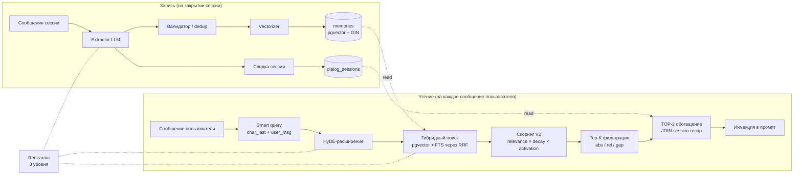
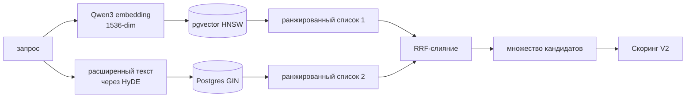
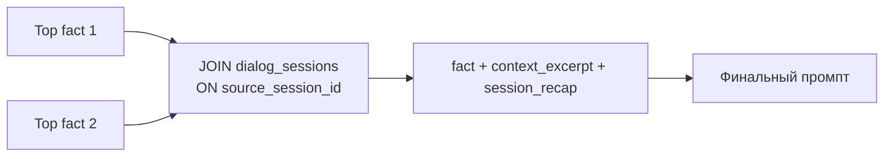

# BER — Brain-Enhanced Retrieval

Система долговременной памяти для AI-компаньонов. Документ описывает архитектуру, модель скоринга, пайплайн извлечения и операционные компромиссы.

---

## 1. Постановка задачи

Наивный RAG поверх истории чата — «нарезать каждое сообщение на чанки, посчитать эмбеддинги, взять top-k по косинусу, склеить в контекст» — разваливается на длинных диалогах. Уже на первой-второй неделе использования всплывают четыре характерных режима отказа:

1. **Слепота к свежести.** Чистое косинусное ранжирование не имеет понятия о времени. Факт, извлечённый три месяца назад, конкурирует на равных с тем, что был зафиксирован вчера. У чисто recency-взвешенного поиска обратная проблема: модель забывает identity-уровневые факты («имя», «профессия», «кличка питомца»), потому что они стареют наравне с шумом.
2. **Семантический разрыв на вопросах.** Пользователь пишет `"do you go to therapy?"`. В памяти лежит факт `"Visits a therapist biweekly via video call."` Косинусное расстояние между ними велико — вопрос и ответ живут в разных областях пространства эмбеддингов. Recall@k проседает ниже 50% именно на тех запросах, которые важнее всего.
3. **Потеря контекста.** Факт вида `"Loves long walks at sunset"` имеет смысл только потому, что был сказан *воскресным вечером в разговоре про бабушку пользователя*. Без контекста модель поднимает факт с неверной интонацией в неподходящий момент. Поиск становится формально корректным и эмоционально неверным.
4. **Галлюцинации при извлечении.** Если экстракция работает по каждому сообщению в реальном времени, LLM записывает в долговременную память спекулятивный или транзитный материал: `"User is feeling sad today"` оказывается в долгом сторе и через три недели всплывает как устойчивая черта.

BER решает каждую из этих задач напрямую. Дальнейшее изложение — про то, как именно.

---

## 2. Обзор архитектуры



Два архитектурных решения отличают систему от учебникового RAG:

- **Запись на границах сессий**, а не на каждом сообщении.
- **Мультипликативный скоринг** по трём ортогональным осям (семантика, время, поведение) вместо линейной суммы.

Дальнейшие разделы раскрывают оба решения и сопутствующую инфраструктуру.

---

## 3. Четыре типа памяти

Каждый извлечённый факт принадлежит одному из четырёх типов. Тип определяет и промпт извлечения, и веса в поиске.

| Тип               | Владелец  | Пример                                              | Полураспад     |
|-------------------|-----------|-----------------------------------------------------|----------------|
| `user_fact`       | user      | "Programmer, ships side projects on weekends"       | месяцы         |
| `persona_event`   | character | "Went to a yoga class this morning"                 | дни            |
| `persona_insight` | character | "Notices the user pulls back when stressed"         | недели         |
| `shared_moment`   | shared    | "Watched the same sunset over a video call"         | недели         |

Плюс пятый тип — `lora_fact`, статический бэкстори персонажа. Эти факты иммунны к TTL и трактуются как identity-уровневые: они не затухают только потому, что давно не использовались.

---

## 4. Мультипликативный скоринг V2

Главное решение ранжирования: как сравнить 90-дневный, важный, семантически идеальный факт с 1-дневным, средне релевантным, который уже доставали из памяти пять раз?

Линейная сумма
```
score = w1·sim + w2·recency + w3·importance + w4·type_bonus
```
вынуждает каждый вес быть компромиссом. У неё к тому же неверная топология: высокий `recency` *всегда* поднимет слабое семантическое совпадение над сильным, если веса выставлены небрежно. Перекрёстный член, который реально нужен — «релевантно **и** свежо **и** уже было полезно» — в линейной сумме не выражается.

### 4.1 Формула

```
score = relevance × decay × activation × core_boost × category_boost

relevance      = similarity × importance_norm × type_factor
decay          = max(floor, age_decay × use_decay)
activation     = exploration_bonus            if access_count = 0
               = 1.0                          if access_count = 1
               = min(cap, 1 + ln(count)·k)    if access_count ≥ 2
core_boost     = 1.25 if is_core else 1.0
category_boost = 1.15 if fact_category in query_categories else 1.0
```

```mermaid
flowchart TB
    SIM[косинусная близость]
    IMP[importance / 10]
    TF[type factor<br/>0.85–1.20]

    SIM --> REL[relevance]
    IMP --> REL
    TF --> REL

    AGE[age_decay<br/>1/(1+age·rα)]
    USE[use_decay<br/>1/(1+idle·rβ)]

    AGE --> DEC[decay]
    USE --> DEC

    AC[access_count] --> ACT[activation<br/>лог-ограниченная]

    CORE[is_core flag] --> CB[core_boost]
    CAT[совпадение категорий] --> CT[category_boost]

    REL --> S((score))
    DEC --> S
    ACT --> S
    CB --> S
    CT --> S
```

Каждая ось отвечает на свой вопрос:

- **Relevance** — «совпадает ли с запросом?»
- **Decay** — «жив ли факт во времени?»
- **Activation** — «был ли он полезен раньше?»
- **Core / category boosts** — мягкие тематические приоры.

### 4.2 Почему мультипликативная схема

У произведения три свойства, которых нет у линейной суммы:

1. **Veto.** Факт с `similarity = 0` обнуляет весь скор. Никакой recency или активацией нельзя воскресить нерелевантный факт. Это ровно желаемое поведение; в линейной сумме приходится постоянно подкручивать `w1` вверх, чтобы такой провал подавить.
2. **AND-семантика.** «Релевантно **и** живо» даёт значительно больший скор, чем два факта, каждый из которых хорош только по одной оси. Система естественным образом предпочитает факт, хороший во всём.
3. **Ограниченное взаимодействие.** Поскольку каждая ось нормирована примерно в `[0, ~1.5]`, ни одна ось не разгоняется в бесконечность. Activation ограничена потолком (`ACTIVATION_CAP`), у decay есть пол, type factor невелик. Произведение остаётся интерпретируемым.

### 4.3 Разобранный пример

Запрос: *"do you remember my dog?"*. Гибридный поиск возвращает три кандидата:

| Воспоминание                                           | sim  | importance | возраст (д) | idle (д) | access | тип             | is_core |
|--------------------------------------------------------|------|-----------:|------------:|---------:|-------:|-----------------|:-------:|
| A: "User has a corgi named Biscuit"                    | 0.78 |          8 |          45 |       12 |      6 | `user_fact`     |   yes   |
| B: "User mentioned 'the dog' last week"                | 0.61 |          4 |           6 |        6 |      0 | `user_fact`     |    no   |
| C: "Character read about pet psychology"               | 0.42 |          5 |          30 |       30 |      1 | `persona_event` |    no   |

При `α = 0.02`, `β = 0.05`, с importance-демпфированием для `β` на высокоимпортантных фактах:

```
A: relevance   = 0.78 · 0.80 · 1.10           = 0.686
   age_decay   = 1/(1 + 45·0.02)              = 0.526
   use_decay   = 1/(1 + 12·0.05·0.32)         = 0.839   (демпфировано, imp=8)
   decay       = 0.526 · 0.839                = 0.441
   activation  = 1 + ln(6)·0.15               = 1.269
   core_boost  = 1.25
   score_A     = 0.686 · 0.441 · 1.269 · 1.25 = 0.480

B: relevance   = 0.61 · 0.40 · 1.10           = 0.268
   age_decay   = 1/(1 + 6·0.02)               = 0.893
   use_decay   = 1/(1 + 6·0.05·0.95)          = 0.778
   decay       = 0.694
   activation  = 1.05  (exploration bonus)
   score_B     = 0.268 · 0.694 · 1.05         = 0.195

C: relevance   = 0.42 · 0.50 · 0.90           = 0.189
   age_decay   = 1/(1 + 30·0.02)              = 0.625
   use_decay   = 1/(1 + 30·0.05)              = 0.400
   decay       = 0.250
   activation  = 1.0
   score_C     = 0.047
```

Ранжирование: **A (0.48) ≫ B (0.20) ≫ C (0.05)**. A выигрывает несмотря на то, что в семь раз старше B, потому что это identity-факт (высокая importance, core), семантически точнее, и уже доставался ранее. C корректно опущен: слабое совпадение, слабая история.

Линейная сумма на тех же входах при любых разумных весах даёт куда более узкий разброс и часто продвигает B за счёт свежести. Мультипликативная формула кодирует фактически нужную семантику: «здесь A — правильный ответ, с большим отрывом».

### 4.4 Пол затухания

Два типа фактов защищены от полного затухания:

- `lora_fact` — бэкстори персонажа. Это часть identity. Пол **условен по similarity**: если `sim < 0.40`, пол не применяется, иначе старый нерелевантный факт бэкстори всегда побеждал бы свежий, тематически точный диалоговый факт.
- Высокоимпортантные `user_fact` и `shared_moment` (importance ≥ 7). Имя, день рождения и работа пользователя не перестают быть истиной из-за того, что их не вспоминали в этом месяце.

### 4.5 Адаптивная фильтрация

После скоринга трёхступенчатый фильтр сжимает множество кандидатов до top-k:

1. **Абсолютная отсечка** — всё ниже абсолютного пола отбрасывается (отсекает шум).
2. **Относительная отсечка** — всё ниже `top_score × relative_threshold` отбрасывается (сужает выдачу при явном лидере и расширяет при близких скорах).
3. **Gap-отсечка** — список разрезается на первом крупном разрыве между соседними скорами. Скачки активации создают естественные кластерные границы; фильтр их уважает.

Относительный порог стоит около 0.55, не 0.85. В мультипликативной системе с активацией до 1.5 топовый скор может быть `>1.0`, и порог 0.85 отрезал бы всё, кроме лидера. 0.55 в типовом случае пропускает 3–4 факта.

---

## 5. Гибридный поиск

Два ретривера, объединённые слиянием.



### 5.1 Векторная сторона: pgvector HNSW

В таблице `memories` есть колонка `vector(1536)` с HNSW-индексом. Метрика — косинусное расстояние. HNSW предпочтительнее IVFFlat в этом сценарии, потому что:

- Recall@k выше при том же бюджете памяти.
- Индекс инкрементально обновляем (воспоминания пишутся посессионно, не большими батчами).
- Латентность на наших масштабах (10⁴–10⁶ векторов в namespace персонажа) — менее 50 мс.

### 5.2 Текстовая сторона: Postgres GIN

`memories.summary` и `memories.context_excerpt` индексируются GIN поверх `tsvector`. Это ловит точные токенные совпадения, которые эмбеддинг пропускает: имена собственные, сленг, конкретные формулировки предпочтений (`"crunchy peanut butter"`, не `"smooth"`).

### 5.3 Слияние: RRF, не взвешенная сумма

Reciprocal Rank Fusion (взвешенное слияние рангов):

```
RRF(d) = Σ_r  1 / (k + rank_r(d))
```

RRF используется вместо `α·sim + (1-α)·bm25` по одной практической причине: **два этих скора не находятся в одной шкале и никогда не будут.** Косинус ограничен диапазоном `[-1, 1]`. BM25 не ограничен и сильно пляшет от статистик корпуса. Любая взвешенная сумма требует подкрутки `α` под каждый деплой, и эта подкрутка плывёт по мере роста корпуса.

RRF использует только ранги. Метод свободен от шкал, параметрически устойчив (`k=60` подходит почти везде) и работает сразу, как только есть два ранжированных списка. Слитое множество кандидатов затем переранжируется функцией скоринга V2 — туда и заходят временные и поведенческие сигналы.

### 5.4 Пред- и пост-фильтры

- **Пред-фильтр (RPC):** `user_id`, `character_id`. Дешёвые предикаты — выполняются в SQL.
- **Пост-фильтр:** штрафы по типу для шумных типов, жёсткая косинусная отсечка (`< 0.20` отбрасывается), отдельный порог для бэкстори (бэкстори учитывается только при `≥ 0.40` — HyDE, см. §7, генерирует в стиле бэкстори и иначе тянул бы нерелевантную биографию).

---

## 6. Обогащённые эмбеддинги

Сам по себе факт слишком короток, чтобы хорошо эмбеддиться. `"Loves long walks at sunset"` сталкивается с сотнями обобщённых описаний. Дискриминативная информация лежит в *почему и когда* это было сказано.

Схема `memories` хранит `context_excerpt` (≤300 символов) рядом с фактом. На стадии извлечения LLM просят выдать оба поля сразу:

```
fact:            "User is afraid of flying"
context_excerpt: "Said this while planning a winter trip;
                  mentioned a turbulent flight from college."
```

При векторизации факт и контекст соединяются разделителем, и эмбеддинг считается уже от объединённой строки. Результат живёт в том же 1536-мерном пространстве, но вектор теперь заякорен эпизодической деталью.

Это даёт три измеримых улучшения:

1. **Recall@k растёт** на 15–25 процентных пунктов на длиннохвостных запросах: контекст содержит ровно те токены, которые пользователь, скорее всего, использует снова.
2. **Дедупликация становится чище.** Два внешне похожих факта (`"likes coffee"` × 3) с разным контекстом больше не схлопываются по ошибке.
3. **Тон становится точнее.** TOP-2 поиск поднимает *момент*, а не только существительное. Нижестоящая LLM неявно использует контекст при генерации ответа.

Почему конкатенация, а не более изощрённое слияние (CLS-token average, learned projection)? Для коротких фактов (до ~300 токенов суммарно) конкатенация позволяет attention энкодера сделать своё дело: энкодер обучен на естественной прозе. Что-то более хитрое потребовало бы fine-tuning энкодера; маржинальный выигрыш мизерный против инженерных затрат.

---

## 7. HyDE-расширение запроса

Семантический разрыв между вопросом и ответом — крупнейший источник потерь recall в conversational RAG. HyDE — Hypothetical Document Embeddings — закрывает его.

Идея: вместо того, чтобы эмбеддить вопрос пользователя, попросить небольшую LLM написать, как выглядел бы *ответ*, в стиле хранимых фактов. И эмбеддить уже его.

```
user query:    "do you go to therapy?"
HyDE output:   "Visits a therapist biweekly via video call;
                considers it professional hygiene."
embed(HyDE) → cosine similarity with stored fact ≈ 0.83
embed(query) → cosine similarity with stored fact ≈ 0.41
```

Несколько важных деталей реализации:

- **Контекст персонажа инжектится.** В HyDE-промпт включается компактный hint о персонаже (имя, профессия, ключевая черта). Без него LLM галлюцинирует обобщённые факты, которые попадают в обобщённые персоны, а не в эту конкретную.
- **Учёт многоходовых диалогов.** К запросу добавляются последние несколько реплик, чтобы follow-up-запросы (`"tell me more"`) получали связное расширение.
- **Низкая температура, малый max tokens.** Здесь не нужна творческая генерация — нужна короткая строка в форме одного факта. `temp=0.2, max_tokens=60` достаточно.
- **Мягкий fallback.** При таймауте или ошибке пайплайн откатывается на smart query (см. §8). HyDE никогда не блокирует поиск.
- **Бюджет латентности.** ~300 мс на быстрой модели. Стоимость амортизируется относительно последующего вызова поиска; общая стоимость памяти на одну реплику чата остаётся sub-second.

HyDE не бесплатен — это дополнительный LLM-вызов на запрос. Но улучшение recall на единицу стоимости — самое высокое среди всех точечных вмешательств в пайплайн.

---

## 8. Smart query — построение запроса

Ещё до запуска HyDE строится более качественная, чем сырое сообщение, строка-запрос — через конкатенацию:

```
embedding_query = character_last_reply + " " + user_message
```

Это тривиально решает проблему *референции*: пользовательское `"yeah, that's what I meant"` бессмысленно само по себе; в связке с предыдущей репликой персонажа оно превращается в запрос, с которым ретриверу есть с чем работать.

Когда доступно больше реплик, в качестве сниппетов используются последние 4–6 сообщений, склеенные разделителем. Сообщение пользователя остаётся в конце — энкодеры чуть сильнее весят финальные токены, и текущий интент должен доминировать.

Это Tier-1-обогащение. HyDE (Tier-2) заменяет его при успехе. При ошибке HyDE smart query становится fallback. При двойной ошибке — сырое сообщение пользователя как Tier-0. Три вложенных fallback — поиск не падает никогда.

---

## 9. TOP-2 обогащение

После скоринга и фильтрации топовые 1–2 факта обогащаются session recap перед инъекцией в промпт.



`session_recap` — это сводка из 100–150 токенов о сессии, в которой был извлечён факт; она генерируется при закрытии сессии. Она даёт LLM эпизодическую обвязку вокруг факта, а не только сам факт.

Практические замечания:

- **Batch JOIN.** Один запрос на оба топовых факта, не два round-trip.
- **Мягкий fallback.** Отсутствующий или короткий recap (`< 20` символов) — откат на `context_excerpt`.
- **Именно TOP-2, не TOP-K.** Каждый recap — 100+ токенов. Добавлять их к каждому извлечённому факту — раздуть промпт. Топ-2 несут диалоговый вес; остальные перечисляются компактно.

Это та единственная фича, которая чаще всего создаёт у модели ощущение, что она «реально помнит».

---

## 10. Извлечение на закрытии сессии (а не в реальном времени)

Извлекать факты на каждом сообщении выглядит как правильный ход и является неправильным. Три причины:

1. **Качество.** Суммаризатор уровня сессии видит весь её ход — фактический вывод пользователя, а не первую эмоциональную реакцию. `"User is angry"` превращается в `"User vented about a coworker; resolved it by the end of the session."` Последнее достойно памяти; первое — шум.
2. **Дедупликация.** Внутри одной сессии один и тот же факт всплывает 4–5 раз. Извлечение по сообщениям производит 4–5 почти-дубликатов и заставляет dedup-движок убирать за собой. Извлечение на закрытии позволяет LLM сделать один проход и выдать один факт.
3. **Стоимость.** Извлечение — самый дорогой LLM-вызов в системе. По-сообщенное извлечение умножает стоимость на длину сессии; по-сессионное — ограничивает её сверху.

Цена этого решения — свежесть: факты текущей сессии пока не доступны для поиска. Компенсация — активные сообщения сессии держатся прямо в контексте LLM (краткосрочная память) до закрытия сессии (обычно — 30 минут тишины). Долговременная память — для сессий, которые уже завершены.

Триггеры извлечения:

- **Idle close** (по умолчанию ~30 минут тишины).
- **Жёсткий лимит** на длину сессии.
- **Ручной триггер** с уровня приложения (например, на logout пользователя) — fire-and-forget.

---

## 11. Категориальный классификатор

Keyword-классификатор отображает каждый запрос в 1–3 из ~14 канонических категорий: `health`, `work`, `hobby`, `relationships`, `lifestyle`, `pets`, `identity`, `dreams`, `emotions`, `past` и т.д.

Классификатор:

- **Работает по ключевым словам**, не через LLM. Латентность — микросекунды. Промах ничего не стоит — category boost мягкий.
- **Возвращает список, а не одну категорию.** `"do you have any pets you talk to when you're sad?"` попадает и в `pets`, и в `emotions`.
- **Питает мягкий буст**, а не жёсткий фильтр. WHERE по категории не делается. Множитель 1.15× достаточен, чтобы развязать ничьи без потери recall на ошибках классификатора.

Это прагматичная оптимизация: чистит поиск в типичном случае (вопрос на одну тему), не делая систему хрупкой в нетипичном (кросс-категорийный вопрос).

---

## 12. Стратегия кэширования

Три уровня в Redis, все с TTL 24 часа:

| Ключ                         | Что хранит                                    | Кто читает                        |
|------------------------------|-----------------------------------------------|-----------------------------------|
| `ber:char_data:{id}`         | Сырая строка персонажа                        | Все BER-модули                    |
| `ber:char_ctx:{id}`          | Готовый отформатированный character context   | Extractor, realtime               |
| `ber:char_hint:{id}`         | Компактный hint (имя + роль + черта)          | HyDE prompt                       |

Плюс кэш результатов:

| Ключ            | Что хранит                  | TTL    |
|-----------------|-----------------------------|--------|
| `ber:fact:{id}` | Строка одного факта         | 24 ч   |
| `ber:search:{hash(query+filters)}` | Top-k список результатов | 30 м   |
| `ber:embedding:{hash(text)}`       | Вектор эмбеддинга        | 7 д    |

Два неочевидных решения:

- **Кэшируется отформатированный блок, а не только сырые данные.** Большинство потребителей хотят одну и ту же выходную строку. Кэширование шага форматирования амортизирует построение строки по всем читателям.
- **Обход кэша явный.** Когда вызывающая сторона передаёт свежие `character_last_message`, `recent_messages` или `category_hints`, кэш результатов пропускается. Эти входы меняют ранжирование; кэшированные результаты были бы неверны.

Конкурентные cache miss обрабатываются LRU lock manager. Один запрос наполняет кэш; конкурентные ожидающие коротко блокируются и затем читают. Это исключает «embedding stampede», когда у популярного персонажа резко растёт трафик.

---

## 13. Режимы отказа и митигации

| Режим отказа                              | Митигация                                                                        |
|-------------------------------------------|----------------------------------------------------------------------------------|
| Дублирующее извлечение между сессиями     | Кросс-сессионная семантическая дедупликация (cosine ≥ 0.85) на записи            |
| Устаревшие факты, живущие вечно            | TTL по типу; высокоимпортантные факты получают более длинный TTL; бэкстори — `decay_immune` |
| Слишком агрессивный decay                 | Мультипликативный `decay_floor` исключает обнуление; пол по типам для identity-фактов |
| Расхождение индекса после backfill        | Cron повторной векторизации; флаг `needs_vectorization` с идемпотентными ретраями |
| Холодный старт (пока нет фактов)          | Ингест бэкстори при создании персонажа; profile-mode-набор строк с `is_core`     |
| Таймаут HyDE / отказ API                  | Fallback на smart query → fallback на сырое сообщение                            |
| Отказ векторного бэкенда                  | Деградированный режим — только FTS-поиск (всё равно возвращает результаты)       |
| Всплески стоимости эмбеддингов            | Кэш эмбеддингов (7 д); батч-эндпоинты эмбеддингов; идемпотентная dedup на записи |
| Галлюцинированные факты при извлечении    | Валидатор отбрасывает неподтверждённые утверждения; `importance < 2` дропается   |

---

## 14. Метрики, которые стоит отслеживать

Система памяти без метрик за квартал деградирует в фольклор. Минимально полезный набор:

**Сторона recall**

- **Recall@k** на отложенном наборе запросов против эталонных ID фактов. Замеряется отдельно для запросов в форме вопроса (где работает HyDE) и для утвердительных.
- **Hit-rate**: какая доля поднятых в промпт фактов реально появляется (дословно или перифразой) в ответе модели. Ниже ~30% — система перетягивает.

**Сторона качества**

- **Dedup rate**: доля фактов, отбракованных как дубли при записи. Здоровая система держится в 15–30%; падение к 0 — порог слишком жёсткий, рост к 50% — экстрактор повторяется.
- **Распределение decay**: гистограмма `decay_factor` по всем извлечённым фактам. Если почти всё прижато к полу — decay слишком агрессивен.
- **Распределение importance** извлечённых фактов: поднимаются ли identity-уровневые факты на identity-вопросах и низкоимпортантные на small talk.

**Сторона производительности**

- **End-to-end латентность поиска** (p50 / p95 / p99), разложенная по HyDE / гибридный поиск / скоринг / обогащение.
- **Стоимость эмбеддингов на сессию.**
- **Cache hit rate** по каждому уровню Redis.
- **Глубина очереди векторизации**: факты с `needs_vectorization=true`. Должна сходить к 0 между тиками cron.

**Поведенческая сторона**

- **Распределение activation**: большинство фактов должны набирать access медленно. Факт с `access_count > 50` за неделю — либо реальный любимчик, либо баг поиска; в любом случае требует разбора.
- **Time-to-first-recall**: сколько сессий проходит до первого вспоминания свежеизвлечённого факта. Длинные хвосты (>10 сессий) намекают на мёртвую память, которая должна стареть быстрее.

---

## 15. Резюме

BER — это система памяти, не система поиска. Она построена на допущении, что сложная задача — не «найти ближайший вектор», а «решить, какой факт из всех известных заслуживает попасть в контекстное окно модели именно сейчас».

Составляющие:

1. **Извлечение на закрытии сессии**, не на каждом сообщении — ради качества, дедупа и стоимости.
2. **Эмбеддинг факта вместе с контекстом** — ради дискриминативной силы на коротком тексте.
3. **Гибридный поиск через RRF** — чтобы объединять pgvector и FTS без калибровки шкал.
4. **HyDE-расширение с контекстом персонажа** — чтобы закрывать семантический разрыв между вопросом и ответом.
5. **Мультипликативный скоринг** по relevance × decay × activation — ради AND-семантики, которую линейная сумма выразить не способна.
6. **TOP-2 обогащение через session recap** — чтобы LLM получала эпизод, а не только факт.
7. **Трёхуровневое кэширование** — чтобы амортизировать стоимость всего вышеперечисленного.

Каждый компонент тестируем независимо, заменяем независимо и измеряем независимо. Это и есть свойство, вокруг которого система проектировалась.
