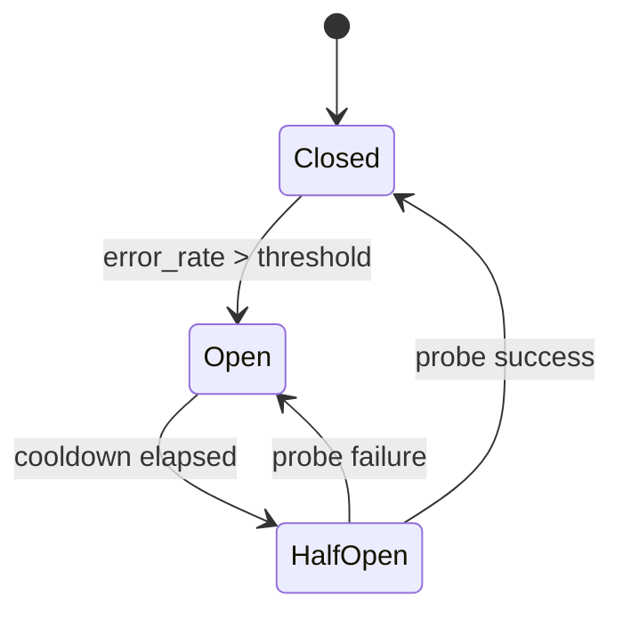

# LLM-инженерия — multi-provider routing, кэширование и контроль стоимости

> Production LLM-приложение — это не "мы зовём API". Это маленькая распределённая система, чьи зависимости вне вашего контроля, чья unit-экономика смещается ежеквартально, а режимы отказов недетерминированы. Этот документ описывает, как пайплайн сообщений справляется с этими реалиями.

---

## 1. Проблема одного провайдера

Первая итерация LLM-приложения обычно выглядит так:

```python
client = OpenAI(api_key=...)
response = client.chat.completions.create(model="gpt-4o", messages=...)
```

Для прототипа норм. Для продукта — нет. Один провайдер — это single point of failure минимум по шести измерениям:

| Риск | Режим отказа | Типовая частота в индустрии |
|---|---|---|
| **Outage** | Провайдер возвращает 5xx часами. | Несколько раз в квартал у каждого крупного провайдера. |
| **Rate limits** | Внезапные 429 при всплесках трафика. | Ежедневно при органическом росте. |
| **Сдвиги цен** | Цена за токен удваивается или исчезает discount-tier. | Несколько раз в год. |
| **Депрекация модели** | Эндпоинт возвращает 410 без миграционного пути в ваши сроки. | Каждые 6–18 месяцев на семейство моделей. |
| **Рационирование capacity** | Провайдер тихо троттлит модель в пользу enterprise-клиентов. | Регулярно во время отраслевых пиков. |
| **Дрейф latency** | p95 удваивается week-over-week без анонса. | Постоянно. |

Стандартное смягчение — **слой абстракции провайдеров** с fallback-цепочкой. Этот документ описывает одну такую абстракцию плюс инструменты учёта стоимости и observability, живущие поверх неё.

---

## 2. Слой абстракции провайдеров

### 2.1 Протокол

Один Protocol покрывает все семейства моделей, используемые пайплайном:

```python
class LLMProvider(Protocol):
    name: str  # например "direct-A", "aggregator-B"

    async def generate(
        self,
        messages: list[ChatMessage],
        model: str,
        *,
        max_tokens: int,
        temperature: float,
        response_format: ResponseFormat | None = None,
        deadline: datetime | None = None,
        tracking: TrackingContext | None = None,
    ) -> LLMResponse: ...
```

`LLMResponse` единый для всех провайдеров:

```python
class LLMResponse(BaseModel):
    text: str
    prompt_tokens: int
    completion_tokens: int
    cached_tokens: int = 0
    cost_usd: float
    provider: str
    model: str
    latency_ms: int
    finish_reason: str
```

Эта форма не обсуждается. Всё provider-specific (например, raw response objects, внутренние cache-маркеры) либо нормализуется в эту структуру, либо отбрасывается. Вызывающий код никогда не должен знать, какой провайдер ответил.

### 2.2 Два конкретных адаптера

**`DirectProvider`** — first-party API одного вендора (в стеке FORELDR это **xAI Direct** для Grok 4.1 Fast и **DeepSeek Direct** для DeepSeek V3.2). Используется на горячем пути, потому что предлагает:
- Нативный prompt caching (где поддерживается).
- Меньшую latency (нет накладных расходов агрегатора).
- Прямую видимость rate-лимитов.

**`AggregatorProvider`** — мульти-вендорный роутер (в стеке FORELDR — **OpenRouter**), маршрутизирующий запросы по нескольким нижестоящим вендорам. Используется как fallback, потому что предлагает:
- Широкую доступность моделей.
- Умное queueing по нескольким нижестоящим вендорам.
- Устойчивость, когда какой-то один вендор лежит.

Абстракции всё равно, какой из них какой. Fallback-обёртка (раздел 5) трактует обоих как непрозрачные `LLMProvider`-инстансы.

### 2.3 Почему не абстрагироваться напрямую над OpenAI SDK?

OpenAI SDK — отличный HTTP-клиент. И плохая абстракция. Причины:

- В него зашиты OpenAI-специфичные концепции (формы function calling, классы ошибок), которые не транслируются чисто.
- Он предполагает один base URL на клиента. Multi-provider всё равно означает несколько клиентов.
- Он не выдаёт cache-метаданные в едином виде между провайдерами, которые все по совпадению "OpenAI-compatible".

SDK используется **внутри** каждого адаптера как HTTP-слой. Адаптеры выставляют наружу Protocol выше. Это держит `httpx`-уровневые заботы (таймауты, ретраи, заголовки) внутри адаптера, а продуктовые заботы (cost, fallback, tracking) — снаружи.

---

## 3. Стратегия маршрутизации

Пайплайн гоняет четыре типа LLM-нагрузки, у каждого свой trade-off latency/cost/quality:

| Нагрузка | Терпимость к latency | Требование к качеству | Маршрутизация |
|---|---|---|---|
| **Принятие решений** (Brain-этап, Grok 4.1 Fast) | ≤ 800 мс p95 | Structured JSON, высокая точность по safety-вердикту | xAI Direct → OpenRouter fallback. |
| **Генерация** (Text-этап, DeepSeek V3.2) | ≤ 1500 мс p95 | Стилистическая верность, голос персонажа | DeepSeek Direct → OpenRouter fallback. |
| **Embeddings** (Qwen3-Embedding-8B) | ≤ 500 мс p95 | Стабильность между батчами | Один OpenRouter-маршрут. Надёжность важнее latency. |
| **Background** (суммаризация, violation analyzer, ingestor — Llama 3.1 8B) | минуты допустимы | Планка ниже | Только OpenRouter. Минимально приемлемая модель. |

Маршрутизация закодирована как маленькие политики, а не как разбросанные условия:

```python
class RoutingPolicy:
    decision = ProviderChain([direct_grok, aggregator_grok])
    generation = ProviderChain([direct_deepseek, aggregator_deepseek])
    embeddings = ProviderChain([aggregator_qwen3])
    background = ProviderChain([aggregator_llama_8b])
```

Два принципа:

1. **Горячие пути идут сначала через прямого провайдера.** Direct API обычно поддерживают автоматический prompt caching, который — крупнейший доступный рычаг стоимости (раздел 4).
2. **Embeddings и background-работе не нужна fallback-цепочка к direct-провайдеру.** Они терпят латентностный профиль агрегатора и выигрывают от его разнообразия моделей.

### Mapping задача → модель

Распространённое заблуждение: одна модель обслуживает все задачи. В продакшене правильный ответ:

| Задача | Класс модели | Конкретная модель в FORELDR | Почему |
|---|---|---|---|
| Safety + intent + decision (Brain) | Быстрая small/medium модель с сильным JSON-mode | Grok 4.1 Fast | Бюджет latency жёсткий, JSON-дисциплина важнее литературного навыка. |
| Реплика персонажа (Text) | Заточенная под генерацию mid-large модель | DeepSeek V3.2 | Голос персонажа заметно деградирует на маленьких моделях. |
| Embeddings | Специализированная embedding-модель | Qwen3-Embedding-8B | Чат-модель, использованная для эмбеддингов, расточительна и хуже по качеству. |
| Суммаризация, извлечение фактов | Маленькая быстрая модель | Llama 3.1 8B | Background, batch-friendly, дёшево. |

Распределение задач по классам моделей — главный рычаг стоимости после кэширования.

---

## 4. Prompt Caching

Это крупнейшая оптимизация стоимости, доступная в 2026, и она плохо понята.

### 4.1 Что это

Несколько крупных провайдеров реализуют автоматическое или полуавтоматическое кэширование повторяющихся префиксов промпта. Когда один и тот же длинный system prompt отправляется в множестве запросов в коротком окне, провайдер:

- Считает префикс только один раз.
- Берёт долю от per-token цены (часто в 4–10 раз дешевле).
- Возвращает быстрее, потому что префикс уже "просмотрен" моделью.

Формы кэша варьируются:

| Форма | Механизм | Типичная скидка | Где в FORELDR |
|---|---|---|---|
| **Implicit (provider-managed)** | Провайдер автоматически детектит повторяющиеся префиксы; клиент ничего не делает. | В 4 раза дешевле на cached-токенах. | xAI Direct (Grok 4.1 Fast) — Brain Decision. |
| **Explicit (client-marked)** | Клиент выставляет `cache_control` на сегменты промпта. | До 10 раз дешевле, более предсказуемо. | Не используется (нет в текущих провайдерах горячего пути). |
| **Disk-backed (provider)** | Провайдер держит префиксы часами или днями. | В 10 раз дешевле на попаданиях, часто автоматически. | DeepSeek Direct (DeepSeek V3.2) — Text Generation. |

Пайплайн использует implicit и disk-backed формы. OpenRouter (fallback) prompt caching не поддерживает — поэтому маршрутизирован как fallback, не primary. Слой адаптеров нормализует метаданные ответа в единую форму (`cached_tokens`), чтобы телеметрия кэширования не зависела от provider-specific полей.

### 4.2 Когда это работает

Prompt caching окупается, когда:

1. **Префикс стабилен между вызовами.** Persona-промпт на 2 000 токенов, повторяющийся 1 000 раз в час, — учебный случай выигрыша.
2. **Префикс крупный.** Кэш экономит токены, не запросы. Префикс на 100 токенов кэшировать не стоит.
3. **Вызовы укладываются в TTL кэша.** Большинство провайдеров экспайрят кэшированные префиксы через минуты или несколько часов простоя.

Не работает, когда:

1. Префикс промпта меняется на каждый запрос (например, per-user рандомные seed-ы наверху).
2. Вызовы редкие — TTL истекает между попаданиями.
3. Провайдер просто не поддерживает (старые агрегаторы, некоторые open-source эндпоинты).

### 4.3 Измеренный эффект

Реальные цифры для Brain-этапа этого пайплайна со стабильным system prompt'ом ~1 500 токенов:

| Метрика | Без кэша | С кэшем @ 95% hit rate |
|---|---|---|
| Стоимость вызова | $0.0033 | $0.0019 |
| p95 latency | 850 мс | 720 мс |
| Атрибуция cache hit | n/a | 1 425 / 1 500 prompt-токенов |

42% сокращение стоимости — основной заголовок. Улучшение latency скромнее, но реальное.

### 4.4 Инжиниринг кэширования как first-class задачи

Кэширование хрупко, если относиться к нему как к довеску. Практические правила:

- **Стабильный префикс.** Упорядочивайте секции промпта от наименее изменчивых к наиболее: system rules → персонаж → контекст → user message.
- **Никаких timestamp'ов в префиксе.** Инжектируйте информацию о времени *после* кэшируемой секции, если вообще нужна.
- **Cache-aware версионирование промптов.** Когда меняете system prompt — кэш cold-start'ит. Планируйте деплои с учётом этого.
- **Трекайте hit rate per provider/model/stage.** Падение hit rate — опережающий индикатор либо регрессии промпта, либо изменения кэша на стороне провайдера.

Эталонная реализация — в [`code-samples/llm/caching.py`](../code-samples/llm/caching.py).

---

## 5. Fallback-паттерны

### 5.1 Почему простого try/except недостаточно

Наивный fallback:

```python
try:
    return await primary.generate(...)
except Exception:
    return await fallback.generate(...)
```

Этот вариант:
- Будет уходить на fallback на транзиентных сетевых блипах, которые primary бы отыграл одним retry.
- Будет долбить деградировавшего провайдера ретраями во время outage вместо того чтобы дать ему время восстановиться.
- Не имеет понятия deadline — медленный primary плюс медленный fallback легко дают видимые пользователю 30-секундные ходы.

### 5.2 Компоненты

Production fallback-цепочка собирается из четырёх вещей:

#### Circuit breaker (per-provider)

Состояния: `closed` (здоров, шлём трафик), `open` (падает, пропускаем и идём дальше), `half-open` (probe одним запросом после cooldown).



Когда `open`, вызовы short-circuit'ят на следующего провайдера в цепочке без ожидания сетевой ошибки. Именно это не даёт долбить страдающего провайдера.

#### Bounded retry с jittered exponential backoff

```python
delays = [0.1 * (2 ** i) * (0.5 + random()) for i in range(max_attempts)]
```

Ограничен `max_attempts`, jittered чтобы избежать thundering-herd ретраев от множества параллельных запросов, exponential — чтобы дать провайдеру время восстановиться.

#### Распространение deadline

Каждый вызов несёт deadline. Ретраи его уважают. Если следующая попытка вышла бы за deadline — она пропускается.

```python
async def call_with_deadline(provider, *, deadline, ...):
    remaining = (deadline - now()).total_seconds()
    if remaining <= 0:
        raise DeadlineExceeded
    return await asyncio.wait_for(provider.generate(...), timeout=remaining)
```

Это ограничивает worst case для пользователя. Ход не уползёт за бюджет, сколько бы провайдеров ни упало.

#### Provider chain

Собирает всё вышеперечисленное:

```python
class ProviderChain:
    async def generate(self, ...) -> LLMResponse:
        last_error = None
        for provider in self._providers:
            if self._breakers[provider.name].is_open():
                continue
            try:
                return await self._call_with_retry(provider, ...)
            except (TransientError, DeadlineExceeded) as e:
                last_error = e
                self._breakers[provider.name].record_failure()
        raise AllProvidersFailed(last_error)
```

Эталонные реализации:
- [`code-samples/llm/fallback.py`](../code-samples/llm/fallback.py) — circuit breaker, retry decorator.
- [`code-samples/llm/provider.py`](../code-samples/llm/provider.py) — полный `ProviderChain` с конкретными адаптерами.

### 5.3 Что значит "AllProvidersFailed" на практике

Если каждый провайдер в цепочке упал, вызывающий этап откатывается на шаблонный ответ. Для Brain — это безопасное дефолтное решение (`action=respond, intent=chat, all flags=False`). Для Text — tone-appropriate извинение. Пайплайн никогда не пробрасывает необработанное исключение провайдера пользователю.

---

## 6. Инженерия стоимости

### 6.1 Per-call атрибуция

Каждый LLM-вызов пишет usage-запись:

```python
@dataclass
class UsageRecord:
    turn_id: str
    user_id: str
    character_id: str
    stage: str            # "brain" | "text" | "embedding" | "summarization" | ...
    provider: str
    model: str
    prompt_tokens: int
    completion_tokens: int
    cached_tokens: int
    latency_ms: int
    cost_usd: float
    timestamp: datetime
```

Стоимость считается из счётчиков токенов и таблицы тарифов, которой владеет cost-слой:

```python
RATES = {
    ("direct", "small-fast-v1"):  Rate(prompt=0.20, cached=0.05, completion=0.50),  # $/1M токенов
    ("direct", "gen-mid-v3"):     Rate(prompt=0.28, cached=0.028, completion=0.42),
    ("aggregator", "small-fast-v1"): Rate(prompt=0.22, cached=None, completion=0.55),
    ...
}
```

Операционно важны две колонки: `cached_tokens` и `cost_usd`. Из них любой бизнес-вопрос сводится к SQL-запросу.

### 6.2 Трекинг cache hit-rate

Hit rate по provider/model/stage — лучший опережающий индикатор регрессий стоимости:

```sql
SELECT
    provider,
    model,
    stage,
    SUM(cached_tokens)::float / NULLIF(SUM(prompt_tokens), 0) AS hit_rate,
    SUM(cost_usd) AS total_cost
FROM llm_usage
WHERE timestamp > now() - interval '1 hour'
GROUP BY 1, 2, 3;
```

Падение hit rate на 10 пунктов на стабильной нагрузке — баг, занесённый деплоем. Постепенное снижение часами — проблема TTL кэша на стороне провайдера.

### 6.3 Disk caching для повторяющихся вызовов

Помимо provider-side кэширования, application-level кэш ловит **идентичные** вызовы (та же модель, те же messages, те же параметры). Это уместно для:

- Эмбеддинга одних и тех же стандартных строк многократно.
- Повторного запуска детерминированных классификаций.
- Разработки и тестирования, где одна и та же фикстура проигрывается заново.

Это **не** уместно для chat-генерации, у которой temperature > 0 и которая выигрывает от вариативности.

Простая обёртка с keyed-hash:

```python
def cache_key(model: str, messages: list, params: dict) -> str:
    return hashlib.sha256(
        json.dumps({"m": model, "msgs": messages, "p": params}, sort_keys=True).encode()
    ).hexdigest()
```

Поверх Redis или process-local LRU в зависимости от объёма.

### 6.4 Batch API для нерилтайм-нагрузок

Несколько провайдеров предлагают batch API примерно за половину цены синхронных вызовов с доставкой результата в течение 24 часов. Подходящие нагрузки:

- Ночное извлечение фактов по всем закрытым сессиям.
- Массовый re-эмбеддинг при апгрейде embedding-модели.
- Теггинг исторических сообщений для аналитики.

Пайплайн маршрутизирует фоновые задачи через batch там, где SLA позволяет. Тот же `LLMProvider`-Protocol покрывает это; меняется только адаптер.

---

## 7. Изоляция embedding-провайдера

Embeddings — другая форма работы. Тот же Protocol, другой адаптер:

```python
class EmbeddingProvider(Protocol):
    async def embed(
        self,
        texts: list[str],
        model: str,
        *,
        dimensions: int | None = None,
    ) -> list[list[float]]: ...
```

Зачем изолировать?

1. **Разные rate-лимиты и тарифные tier'ы**, которые не должны загрязнять chat-side бюджеты.
2. **Другой режим отказа.** Сбой embedding обычно можно отретраить позже; сбой чата нужно обрабатывать в сессии пользователя.
3. **Другие критерии выбора модели.** Чат-модели оптимизируются под беглость; embedding-модели — под точность retrieval'а.

Пайплайн использует одну embedding-модель с консистентными размерностями, чтобы держать схему vector store стабильной. Смена — это миграция, а не правка конфига.

---

## 8. Бюджеты latency

Целевые значения, используемые в продакшене:

| Этап | p50 | p95 | p99 |
|---|---|---|---|
| Brain (decision) | 350 мс | 800 мс | 1500 мс |
| Text (generation) | 700 мс | 1500 мс | 2800 мс |
| Embedding (single) | 120 мс | 350 мс | 800 мс |
| Embedding (batch 32) | 250 мс | 600 мс | 1200 мс |
| Суммаризация | 800 мс | 2000 мс | 4000 мс |

Две операционные ремарки:

- **p99 — это user experience того 1% пользователей, у кого самые активные сессии.** Они же самые вовлечённые. Относитесь к p99 как к продуктовой метрике, не как к tail-метрике.
- **Регрессия на p50 при стабильном p95 обычно — эффект холодного кэша.** Регрессия на p95 при стабильном p50 — tail-проблема (конкретный провайдер или модель).

---

## 9. Метрик-дашборд

Минимальный LLM-ops дашборд, текстом:

**Стоимость и трафик (последний 1ч, 24ч, 7д)**

| Метрика | 1ч | 24ч | 7д |
|---|---|---|---|
| Общая LLM-стоимость | $X | $X | $X |
| Стоимость на активного юзера | $X | $X | $X |
| Стоимость на ход (медиана) | $X | $X | $X |
| Calls / minute | n | n | n |

**Качество**

| Метрика | Значение | Порог |
|---|---|---|
| Доля успешного парсинга JSON в Brain | 99.6% | > 99% |
| Доля пустых/refusal-ответов в Text | 0.4% | < 1% |
| Доля шаблонного fallback'а | 0.05% | < 0.1% |

**Здоровье провайдеров**

| Провайдер | Cache hit rate | Fallback rate | Error rate (5xx) | p95 latency |
|---|---|---|---|---|
| xAI Direct (Grok 4.1 Fast) | 95% | n/a | 0.2% | 720 мс |
| DeepSeek Direct (V3.2) | 88% | n/a | 0.3% | 1180 мс |
| OpenRouter (fallback) | 0% | 0.4% | 1.1% | 1120 мс |

Пороговые значения — пример таргетов; реальные SLO зависят от продукта. Суть — в форме: cost, quality и provider health трекаются независимо, у каждого — опережающие индикаторы регрессии.

---

## 10. Практические уроки

Неисчерпывающий список того, что кусало в эксплуатации:

- **Prompt caching ломается, когда system prompt включает timestamps или user-specific токены наверху.** Уносите всё переменное содержимое вниз. Аудитьте промпты, как только проседает cache hit rate.
- **Агрегаторы тихо маршрутизируют на тот upstream-вендор, у которого есть capacity.** Это может менять, какое поведение prompt caching вы получаете. Пиньтесь к конкретным upstream-моделям, когда кэширование критично.
- **Provider 5xx с retry-after на 10+ секунд — fail-fast сигнал.** Не ретрайте; circuit-break и маршрут на fallback.
- **Смены размерности эмбеддингов — миграции.** Переход 1536 → 3072 инвалидирует все существующие векторы. Планируйте.
- **`response_format` JSON-mode не безотказен.** Валидируйте каждый ответ. Имейте детерминированный fallback на битый JSON. Никогда не доверяйте модели в том, что она будет выдавать парсимый вывод миллионы раз подряд.
- **Самая дорогая per-message нагрузка — обычно не сам чат.** Background-задачи (суммаризация, извлечение фактов), работающие per-session, могут стоить дороже породившего их чата. Аудитьте их.
- **Регрессии стоимости — обычно регрессии кэша.** Прежде чем подозревать апгрейд модели, проверьте hit rate.

---

## См. также

- [07-llm-stack.md](./07-llm-stack.md) — конкретный LLM-стек FORELDR с обоснованиями выбора моделей (Grok 4.1 Fast, DeepSeek V3.2, Llama 3.1 8B, Qwen3-Embedding-8B), реальными cache hit rate, ценами per message и failure modes.
- [02-els-pipeline.md](./02-els-pipeline.md) — пайплайн сообщений, который этот LLM-слой обслуживает.
- [`code-samples/llm/provider.py`](../code-samples/llm/provider.py) — адаптеры, цепочка, расчёт стоимости.
- [`code-samples/llm/caching.py`](../code-samples/llm/caching.py) — извлечение и трекинг cache-метаданных.
- [`code-samples/llm/fallback.py`](../code-samples/llm/fallback.py) — circuit breaker, retry decorator.
