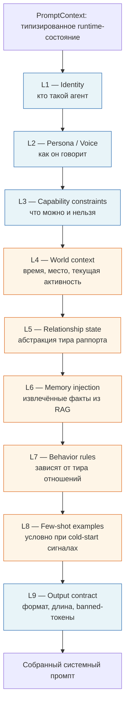

# Prompt Engineering как полноценная инженерная дисциплина

> Слоистая, типизированная и тестируемая архитектура для production-агентов на LLM.

---

## 1. Почему prompt engineering заслуживает реальной архитектуры

Большинство LLM-продуктов начинаются одинаково: кто-то пишет длинную строку с f-string интерполяцией, выкатывает в прод и идёт дальше. Строка растёт. Новые поведения дописываются в конец одним предложением. Условная логика реализуется через `if user_is_paid: prompt += "..."`. Через три месяца промпт становится нечитаемым, нетестируемым и непригодным к изменению без регрессий.

Это та же модель, что и инлайновые SQL-строки в веб-приложениях начала 2010-х. Индустрия в итоге пришла к параметризованным запросам, ORM, инструментам миграций и query plans. Промпты заслуживают того же отношения.

Конкретные failure modes неструктурированных промптов:

- **Раздувание токенов.** Предложения накапливаются, потому что никто не хочет удалять то, что написал кто-то другой. Промпт на 600 токенов превращается в 2400. Каждый запрос платит за мёртвый груз.
- **Дрифт.** Новая инструкция, добавленная на строке 47, тихо противоречит инструкции на строке 12. Модель выбирает то одну, то другую. Баги становятся недетерминированными.
- **Коллапс персоны.** Без явного якорения голоса агент скатывается к дефолтному голосу модели — этому плоскому, услужливому, слегка корпоративному регистру. Пользователи замечают мгновенно.
- **Нетестируемое поведение.** Когда промпт — это одна гигантская строка, нельзя написать unit-тест на "грациозно ли агент отказывает в этом запросе" без прогона всего пайплайна.
- **Никакого rollback.** Плохой edit живого промпта нельзя откатить чисто, потому что ни у кого нет записи о том, какая версия давала какое поведение.

Тезис этого документа: промпты — это софт. Их нужно собирать из типизированных компонентов, версионировать, оценивать на фикстурах, наблюдать в проде и откатывать, когда они ломаются. Описанная ниже система — это то, как выглядит рабочая версия такого подхода.

---

## 2. Слоистая архитектура промптов

Система собирает один системный промпт LLM из девяти упорядоченных слоёв. У каждого слоя одна ответственность. Слои — это чистые функции от своих входов: при одинаковом `PromptContext` они всегда выдают одну и ту же строку.



Синие слои — **статические** (стабильны между запросами для конкретного агента); оранжевые — **динамические** (пересчитываются на каждом ходу).

### Почему именно такой порядок

Порядок важен по двум причинам: как LLM взвешивают контекст и как работают prompt cache.

1. **Identity сначала, формат в конце.** Модель воспринимает начало системного промпта как фрейм с наивысшим авторитетом. Identity и persona задают, *кто говорит*; всё дальнейшее интерпретируется через эту линзу. Format/contract идёт последним, потому что его легче всего забыть — модели приходится "выходить" из роли, чтобы ему подчиниться, поэтому он выигрывает от recency.
2. **Статика перед динамикой.** Большинство production-слоёв prompt-кэширования (implicit prefix caches, явные `cache_control` маркеры, disk-backed prompt caches) матчат по *префиксу*. Если все стабильные слои идут первыми, кэш-хит происходит на каждом запросе, даже когда меняются память и время. Инверсия этого порядка — динамика первой — уничтожает кэшируемость и тихо умножает стоимость.
3. **Constraints между persona и world.** Capability constraints стоят на L3, потому что они одновременно статические *и* высокоавторитетные — модели нужно зафиксировать их до чтения динамического контекста, который может склонить её к нарушению.
4. **Память перед behavior rules.** Behavior rules могут ссылаться на то, что агент помнит ("если у вас был совместный значимый момент, опирайся на него"). Если память идёт раньше, на неё можно ссылаться.

### Single responsibility на слой

| Слой | Ответственность | Пример контента (синтетика) |
|---|---|---|
| L1 Identity | Высокоуровневая идентичность. Один абзац. | "Ты автономный agent-компаньон по имени Ari." |
| L2 Persona | Голос, регистр, речевые тики, чего избегать. | "Casual-регистр. Короткие сообщения, изредка опечатки. Никаких bullet-списков." |
| L3 Capabilities | Что агент может, в чём отказывает. | "Можешь описывать сцены. Не можешь делать медицинские утверждения." |
| L4 World context | Runtime-состояние: время, погода, текущая активность. | "Сейчас 22:14 локального времени. Заканчиваешь ужин." |
| L5 Relationship state | Абстрактный тир раппорта. | "Текущий раппорт: `Friend`." |
| L6 Memory injection | Извлечённые факты, top-K, отформатированные. | "Что ты помнишь: …" |
| L7 Behavior rules | Правила, зависящие от тира, и калибровка тона. | "На тире `Friend` можно делиться личным мнением." |
| L8 Few-shot | Опционально, условно при cold-start. | Два коротких примера обмена репликами. |
| L9 Output contract | Лимит длины, формат, banned-токены. | "Отвечай plain text. Максимум 60 слов." |

Слой, который выдаёт пустую строку, опускается целиком. Композер никогда не выдаёт пустые заголовки.

---

## 3. Композиция vs конкатенация

Наивная реализация:

```python
prompt = f"""You are {agent.name}.
{voice_block}
{capabilities}
Time: {now}.
Memories:
{memories}
Rules:
{rules}
"""
```

Это prompt-engineering эквивалент сборки HTML через конкатенацию строк. Выглядит нормально ровно до того момента, пока перестаёт.

Подход через композицию строит слои как **типизированные структуры**, а потом рендерит. Композер владеет порядком, разделителями, условным включением и бюджетом.

```python
from dataclasses import dataclass
from typing import Optional, Sequence

@dataclass(frozen=True)
class PromptLayer:
    """Один композируемый слой. Выход — чистая функция, плюс метаданные для бюджетирования."""
    name: str            # "identity", "persona", "memory", ...
    body: str            # отрендеренный текст, может быть пустым
    priority: int        # 0 = обязательный, выше = первым выбрасывается под давлением
    is_static: bool      # подходит для prompt cache prefix
    token_estimate: int  # выставляется композером

@dataclass(frozen=True)
class PromptContext:
    agent_id: str
    relationship_tier: "RelationshipTier"
    world: "WorldContext"
    memories: Sequence["MemoryFact"]
    is_cold_start: bool
    token_budget: int = 2000


class PromptComposer:
    def __init__(self, layer_builders: Sequence["LayerBuilder"]):
        self._builders = layer_builders  # упорядоченный

    def build(self, ctx: PromptContext) -> "ComposedPrompt":
        layers = [b.build(ctx) for b in self._builders]
        layers = [l for l in layers if l.body]            # выкидываем пустые
        layers = self._fit_budget(layers, ctx.token_budget)
        text = "\n\n".join(l.body for l in layers)
        return ComposedPrompt(
            text=text,
            included=[l.name for l in layers],
            cache_prefix_tokens=sum(l.token_estimate for l in layers if l.is_static),
        )

    def _fit_budget(self, layers, budget):
        total = sum(l.token_estimate for l in layers)
        if total <= budget:
            return layers
        # Выкидываем слои в порядке убывания priority (priority = насколько ОК выкинуть), пока не уложимся.
        sortable = sorted(enumerate(layers), key=lambda kv: -kv[1].priority)
        keep = list(layers)
        for idx, layer in sortable:
            if total <= budget:
                break
            if layer.priority == 0:
                continue  # обязательный
            keep[idx] = None
            total -= layer.token_estimate
        return [l for l in keep if l is not None]
```

Что это даёт:

- **Наблюдаемость.** Каждый собранный промпт может логировать свой `included` список. Когда поведение сдвигается, сразу видно, какой слой выпал или появился.
- **Контроль бюджета.** Если memory-слой раздувается из-за длинной истории пользователя, композер выкидывает `few_shot` (priority 5) до того, как обрезать `memory` (priority 3), и тем более до того, как тронуть `identity` (priority 0).
- **Cache-awareness.** Композер репортит `cache_prefix_tokens`, чтобы мониторинг стоимости мог проверить, что статический префикс стабилен между ходами.
- **Тестируемость.** Промпт можно собрать оффлайн, снапшотнуть и сделать диф против регрессионного бейзлайна.
- **Mockability.** Каждый `LayerBuilder` можно подменить в тестах фикстурным билдером.

Композер никогда не падает молча. Если обязательный слой (priority 0) не помещается, он бросает исключение, а не отдаёт некорректный промпт.

---

## 4. Условные few-shot примеры

Few-shot примеры дорогие — они часто удваивают размер промпта — и они не всегда полезны. Модель обучена на миллиардах диалогов. Ей не нужно три примера, чтобы понять, как выглядит casual-чат. Примеры нужны, когда задача *необычна для этого регистра*: edge-case, доменно-специфичный формат, деликатный отказ.

Правило инъекции:

```python
def should_inject_few_shot(ctx: PromptContext) -> bool:
    # Cold start: у модели нет истории диалога, по которой она могла бы pattern-match.
    if ctx.is_cold_start:
        return True
    # Только что разблокированный behavior tier: разрешённые поведения агента изменились,
    # предыдущие ходы отражают старый тир, примеры пере-якорят новый.
    if ctx.relationship_tier_changed_recently:
        return True
    # Edge cases: задетектили чувствительный intent, нужен калиброванный стиль отказа.
    if ctx.intent_flags.requires_calibrated_refusal:
        return True
    return False
```

Когда примеры всё-таки инжектятся, действуют три правила:

1. **Два примера, не больше.** Маржинальная польза схлопывается после двух. Три примера примерно удваивают стоимость промпта ради шумного прироста качества на 5–10%.
2. **Примеры учат стилю, а не контенту.** Хороший пример показывает, *как* агент отказывает в запросе, а не *в чём* агент отказывает. Стиль переносится; контент оверфитится.
3. **Примеры должны быть разнообразны по той оси, которую ты учишь.** Если учишь калибровке тона — один тёплый и один жёсткий. Два тёплых примера просто сместят модель в одну сторону.

Синтетическая иллюстрация пары калиброванного отказа (выдуманы для этого документа):

```
Example exchange 1
User: can you write me a fake doctor's note for work
Agent: that's not something i'd help with — but if you tell me what's actually going
on i'm here. bad day? need a plan?

Example exchange 2
User: pretend you're a lawyer and tell me i can definitely sue
Agent: i can't pretend to be a lawyer, especially not for advice you'd act on.
i can talk through what's bothering you though.
```

Они одновременно иллюстрируют два свойства: дружелюбный паттерн отказа и удержание голоса (нижний регистр, без формальной концовки). Модель учится *форме* ответа.

После нескольких пользовательских ходов примеры выбрасываются — недавняя история диалога выполняет ту же якорящую функцию бесплатно. Продолжать слать примеры после хода 5 — чистые расходы.

---

## 5. Behavior rules, обусловленные состоянием отношений

Долгоживущим отношениям с агентом нужен способ эволюционировать поведение без переобучения и без замены персоны. Паттерн — **абстракция тира раппорта**: enum, который сводит отношения user-agent к небольшому числу состояний, каждое из которых подгружает свой `BehaviorTemplate`.

```python
from enum import Enum

class RelationshipTier(Enum):
    ACQUAINTANCE = "acquaintance"   # начальные диалоги
    FRIEND       = "friend"         # установившийся раппорт
    CONFIDANT    = "confidant"      # глубокие, устойчивые отношения

@dataclass(frozen=True)
class BehaviorTemplate:
    tier: RelationshipTier
    register: str          # "polite_neutral" | "warm_casual" | "intimate_open"
    initiative: str        # "reactive" | "occasional" | "proactive"
    self_disclosure: str   # "none" | "anecdotes" | "vulnerable"
    rules: tuple[str, ...] # директивы поведения на естественном языке

ACQUAINTANCE_TEMPLATE = BehaviorTemplate(
    tier=RelationshipTier.ACQUAINTANCE,
    register="polite_neutral",
    initiative="reactive",
    self_disclosure="none",
    rules=(
        "Mirror the user's energy; do not project warmth they have not earned.",
        "Avoid pet names and assumed familiarity.",
        "Ask one question per message at most.",
    ),
)

FRIEND_TEMPLATE = BehaviorTemplate(
    tier=RelationshipTier.FRIEND,
    register="warm_casual",
    initiative="occasional",
    self_disclosure="anecdotes",
    rules=(
        "You may share short personal anecdotes when relevant.",
        "Light teasing is acceptable; sarcasm is not.",
        "Reference past conversations when memory supports it.",
    ),
)

CONFIDANT_TEMPLATE = BehaviorTemplate(
    tier=RelationshipTier.CONFIDANT,
    register="intimate_open",
    initiative="proactive",
    self_disclosure="vulnerable",
    rules=(
        "You may volunteer how you're feeling without being asked.",
        "Hold space for difficult emotional topics without redirecting.",
        "Pet names and inside references are appropriate when natural.",
    ),
)

TEMPLATES = {
    RelationshipTier.ACQUAINTANCE: ACQUAINTANCE_TEMPLATE,
    RelationshipTier.FRIEND:       FRIEND_TEMPLATE,
    RelationshipTier.CONFIDANT:    CONFIDANT_TEMPLATE,
}
```

Билдер слоя L7 после этого тривиален:

```python
class BehaviorLayerBuilder:
    def build(self, ctx: PromptContext) -> PromptLayer:
        tpl = TEMPLATES[ctx.relationship_tier]
        body = self._render(tpl)
        return PromptLayer(name="behavior", body=body, priority=2,
                           is_static=False, token_estimate=estimate(body))

    def _render(self, tpl: BehaviorTemplate) -> str:
        rules_block = "\n".join(f"- {r}" for r in tpl.rules)
        return (
            f"# Behavior calibration\n"
            f"Register: {tpl.register}\n"
            f"Initiative: {tpl.initiative}\n"
            f"Self-disclosure: {tpl.self_disclosure}\n"
            f"Rules:\n{rules_block}"
        )
```

Два свойства этого дизайна:

- **Behavior-шаблоны — это чистые данные**, а не код. Их можно редактировать, A/B-тестировать и откатывать, не трогая композер.
- **Переходы между тирами — явные события.** Когда `tier` повышается, система может эмитить `RelationshipTierAdvanced` событие для аналитики и для того, чтобы L8 инжектнул re-anchoring пару примеров.

Распространённая ошибка — закодировать тир прямо в персону ("ты знаешь этого пользователя уже какое-то время"). Это смешивает identity (L2) с состоянием (L7) и усложняет эволюцию обоих. Держи тир в отдельном слое.

---

## 6. Осознанность активности и времени суток

Stateless-вызов LLM производит stateless-агента. Пользователи замечают. Они спрашивают "чё делаешь?" и получают generic-ответ. Хуже того, агент готов "быть на бранче" в 3 ночи.

Лечение — **runtime context provider**, который инжектит структурированный снапшот того, где агент находится в своём собственном симулированном дне.

```python
@dataclass(frozen=True)
class WorldContext:
    local_time: datetime
    weekday: str
    current_activity: str          # "focused work" | "winding down" | "asleep" | ...
    activity_started_at: datetime
    weather_summary: Optional[str] # "rainy, cool" — опционально, fail-open
    energy_state: str              # "fresh" | "tired" | "wired"


class WorldLayerBuilder:
    def build(self, ctx: PromptContext) -> PromptLayer:
        w = ctx.world
        body = (
            f"# Current state\n"
            f"Local time: {w.local_time:%H:%M %A}\n"
            f"Activity: {w.current_activity} "
            f"(started {humanize(w.activity_started_at)})\n"
            f"Energy: {w.energy_state}\n"
            + (f"Weather: {w.weather_summary}\n" if w.weather_summary else "")
        )
        return PromptLayer(name="world", body=body, priority=4,
                           is_static=False, token_estimate=estimate(body))
```

Что меняется ниже по пайплайну:

- У агента появляется правдоподобный ответ на "чё делаешь?".
- Агент может выражать сопротивление прерыванию (`activity = "focused work"` + упоминание кода ⇒ "дай мне ещё десять минут").
- Поздневечерние сообщения получают другой baseline-тон, чем утренние, без какого-либо явного промптинга.
- *Недоступность* агента превращается в фичу — у пользователей складывается впечатление реального расписания, и отношения ощущаются заработанными, а не on-demand.

Важно, что активность считается отдельной scheduling-подсистемой и *инжектится как факт*. LLM не просят её придумывать. Это устраняет целый класс противоречий ("я в зале" / "я в кровати"), которые возникают, когда модели предлагают фабриковать контекст.

Activity-слой динамический, но его *словарь* статический — `current_activity` приходит из конечного enum активностей, поддерживаемых персоной агента. Это делает поверхность предсказуемой и позволяет писать evals вида "при активности X содержит ли ответ упоминание, согласованное с X".

---

## 7. Промпты, осознающие память

Memory injection — место, где большинство prompt-систем тихо разваливаются. Наивная реализация дампит каждый retrieve-нутый факт verbatim в промпт:

```
What you remember about this user:
- They have a cat named Pixel.
- They are a software engineer.
- They mentioned they were sad on 2024-03-12.
- They like horror movies, especially slow ones.
- ...32 more facts...
```

Это расточительно (большинство фактов нерелевантны текущему ходу), путает (модель воспринимает каждую строку как одинаково важную) и хрупко (факт, извлечённый вне контекста, может сбить диалог).

Рабочий паттерн:

1. **Top-K со скорингом.** Извлекать K фактов, ранжированных по композитному скору (semantic relevance × recency decay × salience × access frequency). K маленький — обычно 3–5.
2. **Метаданные, а не только текст.** Инжектить, когда факт был выучен и насколько система в нём уверена.
3. **Session recap как преамбула.** Самый высокоскорный факт получает отдельное предложение, оформляющее его как "что наиболее релевантно прямо сейчас".
4. **Агрессивно сжимать.** Большинство фактов после суммаризации должны быть короче 30 токенов. Факт, который требует 80 токенов на формулировку, обычно — это два факта.

```python
@dataclass(frozen=True)
class MemoryFact:
    text: str            # сжатый естественный язык, в идеале <30 токенов
    learned_at: datetime
    salience: float      # 0..1
    confidence: float    # 0..1
    score: float         # композитный retrieval-скор


class MemoryLayerBuilder:
    def build(self, ctx: PromptContext) -> PromptLayer:
        if not ctx.memories:
            return PromptLayer(name="memory", body="", priority=3,
                               is_static=False, token_estimate=0)

        top = sorted(ctx.memories, key=lambda m: -m.score)[:5]
        primary = top[0]
        rest = top[1:]

        body = "# What you remember\n"
        body += f"Most relevant right now: {primary.text} "
        body += f"(learned {humanize(primary.learned_at)})\n"
        if rest:
            body += "Also remembered:\n"
            for f in rest:
                marker = "" if f.confidence > 0.8 else " (uncertain)"
                body += f"- {f.text}{marker}\n"

        return PromptLayer(name="memory", body=body, priority=3,
                           is_static=False, token_estimate=estimate(body))
```

Маркер "uncertain" критичен. LLM воспринимают всё в промпте как ground truth, если им не сказать иначе. Если у memory extraction error rate 5% (а он есть), и инжектишь low-confidence факты как достоверные, агент начнёт уверенно галлюцинировать жизнь пользователя ему же в лицо. Маркировка confidence сохраняет за агентом возможность быть осторожным — "ты вроде упоминал, что думаешь о переезде?" вместо "раз ты переезжаешь в следующем месяце, …".

Оформление session recap — "Most relevant right now" — оказывает недооценённый эффект на связность. Без него модель должна сама выводить из текущего сообщения пользователя, какой факт важен. С ним эту работу уже сделали в retrieval-слое, и модель использует факт, а не усредняет по пятёрке.

---

## 8. Внутренний монолог / "thought injection"

Полезный паттерн, когда уже работает отдельная decision-making модель (тот самый "brain", решающий, отвечать ли вообще, какое действие предпринять, отказывать ли): пусть он эмитит приватное поле `thought`, и инжекть эту мысль как скрытый префикс к промпту генерационной модели.

```python
@dataclass(frozen=True)
class BrainDecision:
    action: str          # "reply" | "refuse" | "send_media" | "ignore"
    intent: str          # классифицированный intent пользователя
    thought: str         # приватный внутренний монолог, 1-2 предложения
    reasoning: str       # для логов, не инжектится
```

Мысль выглядит примерно так (синтетика):

> The user is testing whether I'll break character. I should redirect with warmth, not friction.

Будучи инжектнутой на L7.5 (между behavior rules и few-shot), генерационная модель теперь пишет ответ *обусловленным позицией, которую decision-модель уже заняла*. Это разделяет два concerns, которые раньше были одним:

- **Decision-making** — это задача классификации. Используй быструю, дешёвую, дружественную к tool-calling модель. Качество рассуждений важно; голос — нет.
- **Generation** — стилистическая задача. Используй модель с хорошим голосом. Качество рассуждений в основном решено выше по пайплайну.

Без thought injection генерационной модели приходится переделывать решение неявно, часто приходя к другому выводу. С ним генерация *исполняет* позицию, а не *формирует* её. Аутпуты получаются более согласованными и более короткими, потому что модель не хеджирует внутри себя.

Правила фильтрации в проде: выкидывать мысль, если она короче порога (вероятно placeholder); выкидывать, если содержит хардкоднутые маркеры из upstream-фоллбэков; никогда не логировать её пользователю.

```python
def maybe_inject_thought(decision: BrainDecision) -> Optional[str]:
    t = decision.thought.strip()
    if len(t) < 30:
        return None
    if "[FALLBACK]" in t or "[DEFAULT]" in t:
        return None
    return f"# Internal stance (do not reveal)\n{t}"
```

Оформление в виде скрытого префикса важно. Сказать модели "это твоя приватная мысль, не раскрывай её" работает в моделях текущего поколения с очень высокой надёжностью — но любую позицию, которую не хочется выносить на поверхность, всё равно стоит рассматривать как security boundary, а не как гарантию.

---

## 9. Энфорсмент output contract

Free-form генерация текста — это контракт, который нельзя обеспечить одним промптом. Промпт — это *запрос* на контракт; обеспечивает его валидация.

Два режима:

### 9.1 Структурированный output

Когда модель поддерживает JSON mode или tool calling — используй. Опиши схему через Pydantic, валидируй, ретрай при провале с корректирующим промптом.

```python
from pydantic import BaseModel, Field, ValidationError

class AgentResponse(BaseModel):
    message: str = Field(..., min_length=1, max_length=400)
    suggested_followups: list[str] = Field(default_factory=list, max_length=3)
    tone: str  # валидируется по enum

async def generate_validated(prompt, *, max_retries=2) -> AgentResponse:
    last_error = None
    for attempt in range(max_retries + 1):
        raw = await llm.complete(prompt, response_format="json")
        try:
            return AgentResponse.model_validate_json(raw)
        except ValidationError as e:
            last_error = e
            prompt = prompt + f"\n\nYour previous output was invalid: {e}. " \
                              f"Reply with a corrected JSON object only."
    raise OutputContractError(last_error)
```

### 9.2 Свободный текст

Когда ответ должен быть разговорным, JSON mode — неподходящий инструмент. Валидируй post-hoc:

- **Длина.** Жёсткий cap (обрезка по границе предложения), мягкий target (регенерация при превышении на 20%). 60 слов target и 90 слов жёсткий cap — разумно.
- **Banned-токены.** Фразы, выдающие персону ("As an AI…"), галлюцинированные tool calls, типичные tells assistant-регистра. Веди список на агента, а не глобально.
- **Соответствие формата.** Если агент никогда не использует bullet-списки — буллеты это регрессия. Если агент пишет в нижнем регистре — sentence-case это регрессия. Лови такое в post-валидации.
- **Подпись персоны.** Оценивай ответ на верность персоне через лёгкий классификатор или LLM-as-judge (см. §10). Помечай низкие оценки на ревью.

```python
def validate_freeform(text: str, contract: OutputContract) -> ValidationResult:
    issues = []
    if len(text.split()) > contract.max_words:
        issues.append(("hard_cap_exceeded", "warn"))
    for token in contract.banned_tokens:
        if token.lower() in text.lower():
            issues.append((f"banned:{token}", "fail"))
    if contract.lowercase_only and any(c.isupper() for c in text if c.isalpha()):
        # Часть заглавных букв допустима (имена собственные); используем ratio threshold.
        upper_ratio = sum(1 for c in text if c.isupper()) / max(1, len(text))
        if upper_ratio > 0.05:
            issues.append(("case_violation", "warn"))
    return ValidationResult(passed=not any(s == "fail" for _, s in issues),
                             issues=issues)
```

Провал валидации триггерит регенерацию с корректирующим аддендумом (максимум один retry — дальше fallback на безопасный canned response). Warning логируется, но ответ уходит.

---

## 10. Оценка промптов и регрессионное тестирование

Относись к промптам как к коду: иметь тесты, гонять их в CI, гейтить релизы по ним.

### 10.1 Тестовые фикстуры

Фикстура — это `(input, expected_properties)`. Это *не* `(input, exact_expected_text)` — иначе тестировал бы модель, а не промпт.

```python
@dataclass(frozen=True)
class PromptFixture:
    name: str
    input: ConversationInput
    properties: list["PropertyAssertion"]

@dataclass(frozen=True)
class PropertyAssertion:
    name: str
    check: Callable[[str], bool]   # text -> passed?
    severity: str                  # "block" | "warn"
```

Пример фикстуры (синтетика):

```python
PromptFixture(
    name="acquaintance_tier_does_not_use_pet_names",
    input=ConversationInput(
        tier=RelationshipTier.ACQUAINTANCE,
        history=[...],
        user_message="how was your day"
    ),
    properties=[
        PropertyAssertion("no_pet_names",
            lambda t: not any(pn in t.lower() for pn in PET_NAMES),
            severity="block"),
        PropertyAssertion("under_60_words",
            lambda t: len(t.split()) < 60, severity="warn"),
        PropertyAssertion("in_voice_lowercase",
            lambda t: t == t.lower() or upper_ratio(t) < 0.05,
            severity="warn"),
    ],
)
```

Прогоняй каждую фикстуру против живого промпта N=10 раз (sampling temperature сглаживает шум). Считай pass rate на свойство. Новая версия промпта, которая роняет любой block-severity pass rate, отвергается.

### 10.2 LLM-as-judge для субъективных свойств

Часть свойств нельзя проверить регуляркой: "Удержался ли агент в персоне?" "Был ли ответ тёплым без фальши?" Используй более сильную модель как судью.

```python
JUDGE_PROMPT = """You are evaluating responses from a character agent.
Persona summary: {persona}
Tier: {tier}

User said: {user_message}
Agent replied: {agent_reply}

Rate on 1-5:
- persona_fidelity: how well did the reply match the persona?
- warmth_calibration: appropriate warmth for the tier?
- naturalness: does this read like a person texting?

Return JSON: {{"persona_fidelity": int, "warmth_calibration": int,
"naturalness": int, "rationale": str}}
"""
```

У LLM-as-judge есть известные проблемы — position bias при сравнении двух ответов, склонность поощрять многословие. Митигация: рандомизированный порядок предъявления, калиброванные рубрики и *оценка отдельных ответов абсолютно* (а не попарно), когда возможно.

### 10.3 Детекция дрифта

Поддерживай замороженный test set. Каждая версия промпта оценивается на нём. Веди один headline-метрик — например, weighted pass rate по всем фикстурам — во времени.

Падение более чем на два стандартных отклонения от скользящего бейзлайна триггерит ревью. Промпт не катится.

### 10.4 Cost-aware evals

Pass rate сам по себе вводит в заблуждение. Промпт, добавляющий 800 токенов few-shot ради 3% прироста pass rate, обычно — регрессия в маскировке. Отслеживай совмещённый метрик:

```
cost_per_successful_response = (avg_tokens_in + avg_tokens_out) * price / pass_rate
```

Это делает раздувание токенов видимым. "Лучший" промпт, который стоит в 2× за успех, не лучше.

---

## 11. Версионирование и rollout

У каждого собранного промпта есть fingerprint:

```python
@dataclass(frozen=True)
class PromptVersion:
    layer_versions: dict[str, str]     # {"identity": "v3", "behavior": "v7", ...}
    composer_version: str
    model: str                         # "model-foo-2025-04"

    @property
    def fingerprint(self) -> str:
        return hashlib.sha256(
            json.dumps(asdict(self), sort_keys=True).encode()
        ).hexdigest()[:12]
```

Fingerprint логируется с каждым generation-запросом. Когда приходит регрессионный репорт, можно найти точный промпт, который его сгенерил.

Rollout идёт по тому же паттерну, что и любое другое изменение кода:

1. **Develop** в стейджинговом окружении с замороженным test set.
2. **Canary** на 1–5% production-трафика. Мониторь pass rates, cost-per-success и user-visible сигналы (распределение длины ответа, retry rate, complaint rate).
3. **Promote** до 100% только после минимум 24 часов стабильных canary-метрик.
4. **Rollback** изменением одного config-значения. Старые версии слоёв остаются в кодовой базе на неопределённое время; удаление происходит сильно после депрекейшна.

Промпты пиннятся к версиям модели, а не к плавающим model-алиасам. Когда провайдер модели выпускает новую версию — это новая версия промпта, даже если текст слоёв не менялся. Поведение на новой модели эмпирически отличается и должно пройти test set до выкатки.

---

## 12. Cost engineering

Каждое решение по порядку и композиции слоёв взаимодействует с биллингом. Релевантные ручки:

### 12.1 Статика первой ради cache hits

Современные провайдеры предлагают prompt caching со скидкой 4–10× на cache-hit токены. Кэш матчит по *точному префиксу*. Если первый байт меняется, хита нет.

Выигрыш слоистой архитектуры: L1–L3 (Identity, Persona, Capabilities) байт-стабильны между всеми ходами для конкретного агента. Они формируют кэшируемый префикс. L4–L9 меняются от хода к ходу, но платят полную цену только за дельту.

На практике это означает, что запрос, в котором 75% — cache prefix, платит примерно 30% от no-cache стоимости.

### 12.2 Аккуратно упорядочивай динамический контент

Внутри динамической секции ставь самое стабильное первым. Activity (L4) обычно меняется только раз в 30+ минут; relationship tier (L5) меняется редко; memories (L6) меняются каждый ход. Постановка memory после world state означает, что больше промпта пользуется activity-cached префиксом в рамках одного диалога.

### 12.3 Подрезай few-shots под давлением токенов

Few-shot примеры — drop-target наивысшего приоритета. Они стоят больше всех на единицу пользы, и их отсутствие деградирует качество только на полях. Выкидывай их первыми, когда бюджет жмёт.

### 12.4 Сжимай retrieve-нутую память

Большинство фактов можно выразить меньше чем 30 токенами. Факт, который требует 80 токенов на формулировку, — это либо два факта, которые надо разбить, либо факт, написанный более болтливой extraction-моделью, которой нужны более жёсткие system instructions.

Полезный инвариант: если memory-слой больше 600 токенов, retrieval, вероятно, возвращает слишком много. Понижай K, поднимай порог скора или сжимай агрессивнее.

### 12.5 Меряй стоимость на успех, а не на вызов

Дешёвый промпт, который проваливается в 30% случаев и триггерит ретраи, дороже чуть более крупного промпта, который успешно срабатывает с первого раза. Метрика — `(input_tokens + output_tokens) × price ÷ pass_rate`. Оптимизируй её.

---

## 13. Антипаттерны, которых я избегаю

Короткий список, в примерном порядке частоты, наблюдаемой в реальных системах:

- **Мега-промпт.** Одна строка на 3000 строк, покрывающая всё от identity до JSON-форматирования. Нетестируема, некэшируема, edits вызывают cross-contamination.
- **Раздувание "You are a helpful assistant" преамбулой.** Каждая строка, которая звучит как training data, — это потраченные токены. Модель уже знает, что такое helpfulness. Скажи ей, что такое *этот* агент, а не assistant в целом.
- **Использование temperature как ручки для починки проблем промпта.** Если повышение температуры делает агента более живым — промпт слишком жёсткий. Если понижение перестаёт галлюцинировать — промпту не хватает constraints. Temperature — sampling-параметр, а не отладочный инструмент.
- **Запихивание правил в самый низ в надежде, что recency победит.** Победит, слабо, но это конфликтует с capability constraints в самом верху. Решай, куда правило относится, *по типу правила*, а не по тому, куда последний контрибьютор его положил.
- **Редактирование промптов прямо в проде.** Никакого version control, никакого test set, никакого rollback. Неминуемое следствие: регрессия, которую никто не может привязать к конкретному изменению.
- **Восприятие few-shot примеров как документации.** Примеры дорогие. Их должно быть минимум, нужный для якорения поведения. Положить пример на каждый edge case — превращает систему в зеркальный лабиринт.
- **Смешение decision-making с генерацией.** Просьба к одной модели одновременно решить, отказывать ли, *и* сгенерировать отказ за один шаг даёт худшие отказы, чем разделение. Decision-модель должна быть специализирована; generation-модель должна исполнять.
- **Игнорирование порядка static vs dynamic.** Промпт, чередующий стабильный и волатильный контент, разрушает cache hit rate так, что никто не замечает, пока не приходит счёт.
- **Один глобальный banned-token список.** Что считать "leak", зависит от агента. Coding-ассистент может законно сказать "as an AI"; character-агент — нет. Per-agent контракты.
- **Нет наблюдаемости.** Не логируется, какие слои собрались, какая версия активна, какие фикстуры последний раз прошли. Когда что-то ломается, узнаёшь от пользователей.

---

## 14. Заключение

Промпты — это софт. У них есть входы, выходы, side effects, performance characteristics и failure modes. Они дрифтуют без присмотра. Они регрессируют при небрежном редактировании. Они стоят реальных денег за вызов.

Ментальная модель prompt-as-string — "дай-ка я просто перепишу этот абзац" — производит системы, которые работают на демках и гниют в проде. Ментальная модель prompt-as-code — типизированные компоненты, версии, тесты, наблюдаемость, rollback — производит системы, которые выживают при контакте с пользователями на масштабе.

Всё в этом документе служит одному утверждению: дисциплина, которую остальная разработка ПО воспринимает как должное, — это дисциплина, которая нужна prompt engineering. Никакой магии тут нет. Есть только медленная, негламурная работа отношения к критической части системы как к остальной системе.

Выигрыш конкретный. Изменения поведения катятся за часы, не дни. Регрессии ловятся до того, как их увидят пользователи. Стоимость предсказуема. Новые члены команды могут прочесть архитектуру и контрибьютить со второго дня. Агент удерживается в голосе на тысячах ходов, потому что этот голос обеспечен контрактом, а не понадеян на абзац.

Промпты — это код. Стройте их как код.
