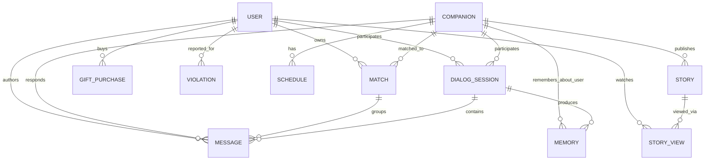

# Дизайн базы данных

Этот документ описывает слой хранения AI-платформы компаньонов: модель сущностей,
выбор хранилищ, стратегию индексации и эксплуатационные практики, которые удерживают
предсказуемую латентность по мере роста объёма данных.

Описанная схема соответствует файлу
[`code-samples/db/schema.sql`](../code-samples/db/schema.sql), а запросы — файлу
[`code-samples/db/queries.sql`](../code-samples/db/queries.sql). Полная продакшн-система
содержит дополнительные ledger- и admin-таблицы; ниже рассмотрены те части,
которые обслуживают 99% read-трафика.

---

## 1. Почему PostgreSQL + Supabase

Платформе нужно хранить три типа данных:

1. **Операционные данные** — пользователи, диалоги, расписания, ledger'ы. Чёткая
   реляционная форма, частые JOIN'ы, жёсткие транзакционные требования.
2. **Векторные эмбеддинги** — долговременная память для retrieval-augmented generation.
3. **Свободный текст** — содержимое сообщений и фрагменты воспоминаний, по которым
   нужен поиск по ключевым словам как fallback к векторному сходству.

Один экземпляр PostgreSQL покрывает все три кейса. `pgvector` закрывает (2) через
HNSW индексы; встроенная связка GIN + tsvector закрывает (3); реляционное ядро
закрывает (1). Один WAL, одна стратегия бэкапов, один планировщик запросов.

Supabase используется как managed control plane: provisioning, point-in-time
recovery, пулинг соединений, Row Level Security в связке со слоем аутентификации,
realtime change data capture. Trade-off реален:

- **Плюсы.** Быстрая поставка, интегрированная аутентификация, Realtime-каналы для
  presence и fan-out "новое сообщение" без самописной инфраструктуры.
- **Компромиссы.** Меньше контроля над параметрами Postgres, чем у self-hosted
  инстанса; часть тюнинга приходится запрашивать или обходить; долгие миграции
  нужно координировать с поведением пулинга соединений. На текущих масштабах
  ничего из этого не блокирует.

Критерий принятия решения был прост: любое хранилище данных, которое не Postgres,
должно обосновать своё существование. Векторный поиск и полнотекстовый поиск
не оправдали добавление новой системы.

---

## 2. Доменная модель



Десять сущностей покрывают доминирующие паттерны доступа. Они разбиваются
на три кластера:

- **Идентификация / pairing**: `users`, `companions`, `user_matches`.
- **Диалог**: `dialog_sessions`, `messages`, `memories`.
- **Engagement / коммерция**: `schedules`, `stories`, `story_views`,
  `gift_purchases`, `violations`.

`user_matches` — связующая таблица между `users` и `companions` с составным
первичным ключом `(user_id, companion_id)`. Всё, что относится к скоупу
пользователя, расходится от этих двух колонок.

---

## 3. Принципы дизайна схемы

### 3.1 Сначала нормализация, потом денормализация по фактам

Большая часть схемы — третья нормальная форма. У каждой сущности один владелец,
каждый факт хранится в одном месте, целостность поддерживается foreign key
и check-ограничениями.

Есть одно осознанное исключение: `user_matches` несёт три денормализованные
колонки — `last_message`, `last_message_at`, `unread_count`. Это проекции
из `messages`, материализованные на строку списка чатов. Причина — форма плана
запроса, а не теоретическая чистота.

#### Запрос, мотивирующий денормализацию

Эндпоинт списка чатов выполняется на каждом cold open приложения. Наивная форма:

```sql
SELECT m.companion_id,
       (SELECT content    FROM messages
         WHERE user_id = m.user_id AND companion_id = m.companion_id
         ORDER BY created_at DESC LIMIT 1) AS last_message,
       (SELECT MAX(created_at) FROM messages
         WHERE user_id = m.user_id AND companion_id = m.companion_id) AS last_message_at,
       (SELECT COUNT(*) FROM messages
         WHERE user_id = m.user_id AND companion_id = m.companion_id
           AND role = 'companion' AND NOT is_read) AS unread_count
  FROM user_matches m
 WHERE m.user_id = $1
 ORDER BY last_message_at DESC NULLS LAST
 LIMIT 50;
```

Три коррелированных подзапроса на каждый match. Каждый делает index lookup
по `messages`, но планировщик не может протолкнуть `LIMIT 50` вниз, потому что
ключ сортировки (`last_message_at`) сам является результатом подзапроса.
При 25 matches на пользователя и 1k+ сообщений на match wall-clock латентность
на тёплом кэше — десятки миллисекунд. На холодном кэше всё гораздо хуже,
а tail-латентность доминирует в пользовательском опыте.

После денормализации запрос превращается в тот, что в `queries.sql §1`: одиночный
index scan по `idx_matches_user_sorted`, ограниченный `LIMIT`, с JOIN к `companions`
по primary key. План не содержит Sort-узла, рабочий набор — одна страница индекса
на match.

#### Как денормализация остаётся корректной

`fn_update_match_on_message` — `AFTER INSERT` триггер на `messages`. Он делает
upsert строки match с новым snapshot последнего сообщения и инкрементирует
`unread_count` только если автор — companion. Два свойства держат его честным:

1. **Идемпотентность при повторах.** Клауза `UPDATE` использует
   `WHERE last_message_at IS NULL OR last_message_at <= NEW.created_at`,
   так что поздно прибывший более старый insert (редко, но возможно при
   разных таймзонах или clock skew) не может перезаписать более свежий
   snapshot последнего сообщения.
2. **Монотонность счётчика.** Инкремент никогда не комбинируется с путём
   "пересчитать с нуля". Сброс принадлежит `mark_chat_read()`, который
   делает один `UPDATE … SET unread_count = 0`. Два писателя не могут
   дважды декрементировать, потому что декремента нет.

#### Race conditions, которые стоит назвать

Два конкурентных insert'а с одним и тем же логическим timestamp коммитятся
в собственном порядке. Триггер отражает порядок коммитов, а не порядок
во view приложения. Для UI чатов это то, чего ожидают пользователи —
сообщение, "выигравшее" гонку в БД, отображается как последнее.

### 3.2 JSONB для полей с эволюционирующей формой

`companions.personality_flavor` имеет тип JSONB. Содержимое меняется по мере
эволюции поведенческой модели: добавляются новые подполя, старые становятся
deprecated. Моделирование каждого варианта как отдельной колонки означало бы
миграцию схемы на каждый продуктовый эксперимент — это неправильная скорость
изменений.

Стратегия индексации:

- **GIN с `jsonb_path_ops`.** Меньше и быстрее дефолтного `jsonb_ops`, когда
  нужен только оператор containment (`@>`). Это совпадает с нашим паттерном
  доступа: "найти companions, у которых flavor содержит `{"voice": "warm"}`".
- **Никаких expression-индексов на горячих ключах.** Следующий продуктовый цикл
  может сделать их устаревшими; жертвуем небольшой raw-скоростью ради
  миграционной эргономики.

Правило: если поле когда-либо является ведущей колонкой в `ORDER BY` или
доминирующим фильтром на горячем запросе, оно заслуживает отдельной колонки.
Иначе JSONB подходит.

### 3.3 Append-only ledger'ы вместо изменяемого состояния

`messages`, `gift_purchases`, `story_views`, `violations` — все append-only.
В нормальной работе нет пути `UPDATE`. Это даёт нам:

- **Предсказуемое поведение индексов.** Никаких HOT-обновлений, никаких widow
  tuples на горячих страницах. Работа vacuum ограничена политикой ретенции,
  а не скоростью записи.
- **Аудит даром.** История — это сама таблица.
- **Простая репликация.** Логическая репликация append-only таблиц лишена
  поверхности конфликтов, характерной для реплицируемого изменяемого состояния.

`user_matches` — явное исключение: денормализованная проекция должна быть
записываемой. Мы принимаем write-amplification, потому что экономия
read-amplification больше.

---

## 4. Векторное хранилище через pgvector

### 4.1 Выбор индекса и параметры

`memories.embedding` — колонка `vector(1024)`, индексируемая HNSW:

```sql
CREATE INDEX idx_memories_embedding_hnsw
    ON memories USING hnsw (embedding vector_cosine_ops)
    WITH (m = 16, ef_construction = 64);
```

- **`vector_cosine_ops`** соответствует модели эмбеддингов: выходы
  L2-нормализованы, поэтому cosine и dot product эквивалентны с точностью
  до константы. Неправильный выбор op-класса здесь — тихий: он просто
  ухудшает recall.
- **`m = 16`** — степень графа на узел. Большие значения линейно увеличивают
  recall и память. 16 — разумный default для корпусов ~1M строк.
- **`ef_construction = 64`** управляет шириной поиска при построении.
  Удвоение даёт примерно в 1.6× более дорогое построение ради заметно
  лучшего recall, вплоть до примерно 200. Тюнингуем на этапе деплоя,
  а не во время запроса.
- **`ef_search`** — runtime-ручка. Выставляется на сессию через
  `SET LOCAL hnsw.ef_search = 80`. Выше — медленнее и больше recall.
  Выставляем со стороны приложения в зависимости от call site (интерактивный
  retrieval vs. фоновый batch).

### 4.2 Стоимость построения и память

HNSW — графовый индекс, поэтому это не дерево страниц, а один большой граф,
в основном держащийся в RAM. Конкретно:

- Таблица 1M × 1024-dim float32 векторов — это ~4 GB на диске только под
  колонку. HNSW индекс лежит сверху со стоимостью на ребро, примерно
  пропорциональной `m`. Планируйте capacity headroom под индекс,
  не только под таблицу.
- Inserts недёшевы; HNSW writes обходят граф. Для high-throughput путей
  ингеста (массовая переиндексация после смены модели) используйте
  временный sister-индекс и `REINDEX CONCURRENTLY`.

### 4.3 Фильтрованный векторный поиск

Запрос retrieval всегда per-(user, companion):

```sql
SELECT id, content
  FROM memories
 WHERE user_id = $1 AND companion_id = $2
 ORDER BY embedding <=> $query
 LIMIT 10;
```

HNSW индекс возвращает приближённых ближайших соседей глобально; планировщик
применяет `WHERE` как фильтр на кандидатах. Для текущего размера корпуса
этого достаточно. Доступны два пути масштабирования:

1. **Партиционирование по `user_id`**, если объём векторов на пользователя
   станет настолько большим, что селективность фильтра разрушит recall.
   Per-partition HNSW индексы восстанавливают O(log N) на партиции.
2. **`ivfflat` вместо HNSW**, если нагрузка read-heavy и запись редкая:
   дешевле в построении, проще композируется с фильтрами через
   паттерны `WHERE … IN (SELECT)`. Мы предпочитаем HNSW, потому что
   у нас не низкая частота записей.

### 4.4 Гибридный retrieval

У чисто векторного сходства известный failure mode: редкие именованные
сущности и точные совпадения сглаживаются энкодером. Чтобы это компенсировать,
параллельно запускаем GIN/FTS-ветку и сливаем ранкинги через Reciprocal Rank
Fusion (см. `queries.sql §4`). RRF — правильный примитив, потому что не
требует сопоставимых шкал score между двумя путями.

---

## 5. Полнотекстовый поиск

Два дизайн-решения, оба осознанные:

- **Generated tsvector колонки**, не триггеры. `content_fts tsvector
  GENERATED ALWAYS AS (to_tsvector('simple', content)) STORED` держит
  деривацию в схеме, где её можно проанализировать. Триггеры, поддерживающие
  ту же колонку, со временем дрифтуют.
- **Конфигурация `'simple'`**, а не language-specific. Разговорный корпус
  многоязычный и содержит сленг, код и эмодзи. Language-specific stemmer
  оптимизируется под один язык за счёт остальных. `'simple'` — правильный
  пол: lossless токенизация, никакого чрезмерного стемминга, полностью
  композируется с гибридным ранкингом.

GIN индексы на обеих колонках `content_fts`. Триграммный индекс
(`gin_trgm_ops`) стоит рядом с FTS на `messages.content` — он обслуживает
admin-кейсы поиска ("упоминал ли этот пользователь когда-либо X"), которые
слишком короткие или зашумлённые, чтобы выразить их через tsquery.

---

## 6. Стратегия индексации

Три паттерна индексов, которые несут большую часть нагрузки:

### 6.1 Композитные индексы под `ORDER BY`

`idx_messages_user_companion_time (user_id, companion_id, created_at DESC)`
обслуживает и фильтры `WHERE user_id = ? AND companion_id = ?`, и
подразумеваемый `ORDER BY created_at DESC LIMIT N`. Планировщик использует
индекс в обратном порядке для DESC, без Sort-узла, без работы пропорциональной
полному match.

DESC значим — без него планировщик всё равно может использовать индекс,
но платит за обратный скан, что менее cache-friendly на старом железе.

### 6.2 Partial-индексы для горячих фильтров

Два примера в схеме:

- `idx_matches_user_sorted … WHERE is_active = true`
- `idx_stories_ready_by_companion … WHERE status = 'ready'`

Soft-deleted matches и ещё не готовые stories — мёртвый груз на каждое
чтение. Partial-индекс полностью исключает их из индекса. Цена в том, что
планировщик должен доказать фильтр на этапе планирования; для статических
литералов это автоматически.

Общее правило: если булева или low-cardinality колонка появляется
"практически в каждом WHERE", partial-индекс почти всегда дешевле полного.

### 6.3 Covering-индексы

Используем `INCLUDE` экономно, потому что он конфликтует с HOT-обновлениями.
Где он помогает — read-heavy reporting-запросы: например, admin-дашборд,
агрегирующий ежедневные счётчики сообщений, может обслуживаться из
индекса `(created_at, user_id) INCLUDE (role)` без обращения к heap.

---

## 7. Авторизация через RLS

Row Level Security — основная модель авторизации. Каждая user-scoped таблица
включает RLS и поставляется с "self"-полиси:

```sql
CREATE POLICY messages_self ON messages
    FOR ALL
    USING      (user_id = current_app_user_id())
    WITH CHECK (user_id = current_app_user_id());
```

`current_app_user_id()` возвращает идентификатор principal'а из
connection-scoped GUC, выставляемого приложением или пулером. Паттерн
намеренно platform-agnostic; продакшн-стеки часто делегируют это
JWT claim resolver'у, предоставляемому слоем аутентификации.

Важны два свойства производительности:

- **Предикат — простое равенство по индексу с ведущей колонкой.** Планировщик
  объединяет предикат полиси с пользовательским `WHERE user_id = ?` в один
  index scan. Измеримых накладных расходов нет.
- **Service-role воркеры обходят RLS.** Фоновые задачи, которым нужно
  работать поперёк пользователей, подключаются под ролью с `BYPASSRLS`.
  Это enforced на уровне соединения, а не в коде приложения.

Чего избегать: писать полиси, вызывающие view'ы или per-row функции.
Они становятся узким местом на больших сканах, потому что не могут быть
inlined в index path.

---

## 8. Паттерны конкурентности

### 8.1 `FOR UPDATE SKIP LOCKED` для очередей

`story_generation_jobs` дозируется хрестоматийным паттерном:

```sql
WITH claimed AS (
    SELECT id FROM story_generation_jobs
     WHERE status = 'pending'
     ORDER BY created_at
     LIMIT 10
     FOR UPDATE SKIP LOCKED
)
UPDATE story_generation_jobs sj
   SET status = 'running', locked_until = now() + interval '5 minutes'
  FROM claimed
 WHERE sj.id = claimed.id;
```

N конкурентных воркеров выполняют этот запрос; каждый получает непересекающийся
срез. Никакого внешнего брокера, advisory locks, contention. Partial-индекс
`idx_story_jobs_pending` удерживает стоимость скана головы очереди ограниченной
числом pending-строк.

### 8.2 Advisory locks для cron-синглтонов

Cron-задачи, которые не должны исполняться параллельно дважды, захватывают
transaction-scoped advisory lock в начале job'а:

```sql
SELECT pg_try_advisory_xact_lock(hashtext('story_status_check'));
```

Если вызов вернул `false`, lock держит другой воркер; job рано завершается.
Дёшево, детерминированно, без отдельной таблицы.

### 8.3 Оптимистичная конкурентность для ledger'ов

`gift_purchases` append-only. Проблемы конкурентности здесь нет.
Для таблиц, где два писателя могут затереть друг друга (например,
обновление счётчика без триггера), используем предикат
`WHERE updated_at = $expected` и проверяем число затронутых строк. Это
дешевле, чем `SELECT … FOR UPDATE`, и избавляет приложение от необходимости
думать о deadlock'ах.

---

## 9. Миграции

Forward-only и идемпотентны:

- Каждая миграция начинается с `CREATE … IF NOT EXISTS` или эквивалента.
- Деструктивные изменения разбиваются на фазы: фаза 1 добавляет новую форму,
  фаза 2 делает backfill, фаза 3 удаляет старую форму. Каждая фаза катится
  независимо.
- Никаких `ALTER TABLE ALTER COLUMN TYPE` на горячих таблицах в foreground.
  Изменение типа идёт через shadow-колонку + backfill + cutover. Альтернатива —
  взять `ACCESS EXCLUSIVE` lock на таблице в 10M строк — это продакшн-инцидент.
- Создание индексов использует `CONCURRENTLY` на горячих таблицах. Цена
  в том, что миграция не может выполняться внутри транзакции; плюс — чтения
  и записи продолжаются, пока индекс строится.
- Backfill'ы батчуются (`UPDATE … WHERE id IN (SELECT … LIMIT 1000)`)
  и rate-limit'ятся. Долгоживущие безграничные `UPDATE`'ы заставляют
  autovacuum плакать и создают одну "fat transaction", которая блокирует
  любой другой DDL на часы.

---

## 10. Мониторинг

Минимальная жизнеспособная поверхность observability для этой БД:

- **`pg_stat_statements`** — топ запросов по суммарному и среднему времени.
  Что угодно из топ-10 любого из списков — кандидат на индекс или
  инспекцию плана.
- **`pg_stat_user_indexes`** — `idx_scan = 0` после полного цикла трафика
  означает, что индекс — мёртвый груз; `idx_tup_read >> idx_tup_fetch`
  означает, что индекс сканируется, но обращение к heap — основной
  источник стоимости.
- **`pg_stat_activity`** — долгоживущие транзакции. Всё старше нескольких
  минут, что не является известной maintenance-задачей, расследуется.
- **`pg_stat_user_tables`** — `n_dead_tup / n_live_tup` — proxy для bloat.
  Триггерим пороги autovacuum до того, как ситуация становится
  некомфортной.
- **`auto_explain`** — включённый со здравым порогом (например, 250 ms)
  захватывает план каждого медленного запроса без необходимости
  воспроизводить.

Дашборд намеренно скучный: латентность запросов p50/p95/p99 на эндпоинт,
сатурация пула соединений, лаг репликации, лаг vacuum, disk I/O wait.
Если эти четыре плоские — БД в порядке.

---

## 11. Принятые trade-off'ы

Короткий список выборов, которые читающий должен иметь возможность оспорить.

1. **HNSW вместо IVF.** Лучше recall при нашей частоте записей ценой
   большего расхода памяти. Пересмотреть, если память станет узким местом
   раньше, чем латентность запроса.
2. **`'simple'` FTS-конфигурация.** Многоязычная устойчивость вместо
   качества per-language ранкинга. Компенсируем векторной веткой.
3. **Денормализованный список чатов.** Две записи на сообщение (insert
   + match update) ради одного быстрого чтения. Правильный выбор, когда
   доминируют чтения списка чатов — а они доминируют.
4. **JSONB для эволюционирующих полей.** Миграционная эргономика вместо
   raw query speed. В тот день, когда JSONB-поле станет горячим ключом
   сортировки, оно будет повышено до колонки.
5. **RLS как основная модель авторизации.** Одна модель авторизации,
   enforced в БД. Цена в том, что каждый код-путь работает под
   user-scoped соединением; выигрыш — в том, что нет места на уровне
   приложения, где можно забыть фильтр.

Схема рассчитана на следующий 10×, не на следующий 1000×. Дальше правильный
ответ — партиционирование таблиц messages и memory по user-хэшу, что
является механическим изменением в рамках уже следуемого паттерна.
