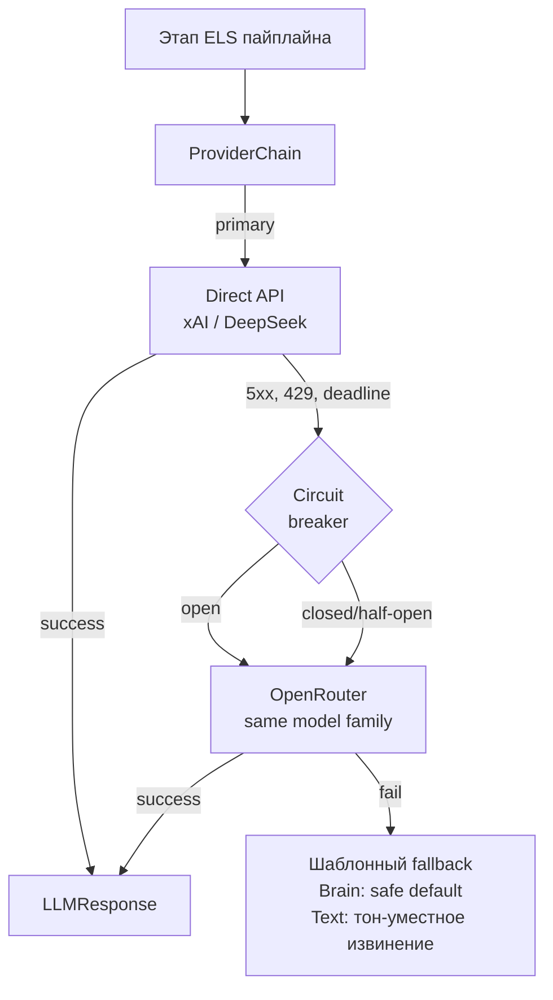

# LLM-стек FORELDR — конкретные модели, провайдеры и обоснования выбора

> Документ описывает фактический LLM-стек, на котором работает FORELDR в продакшене. В отличие от [04-llm-engineering.md](./04-llm-engineering.md), который абстрактно описывает архитектурные паттерны (Protocol-композиция, fallback chain, circuit breaker), здесь даны конкретные имена моделей, конкретные провайдеры и обоснования каждого выбора с цифрами стоимости, latency и cache hit rate. Целевая аудитория — инженер, который оценивает не просто "работает ли", а "почему именно так и какие альтернативы рассматривались".

---

## 1. Сводная таблица стека

| Подсистема | Модель | Провайдер (primary / fallback) | Назначение |
|---|---|---|---|
| **Brain Decision** (safety + intent + decision) | Grok 4.1 Fast | xAI Direct (primary, prompt caching) / OpenRouter (fallback) | Единый LLM-вызов на каждом сообщении: safety-флаги, intent (CHAT/MEDIA/QUESTION), action для пайплайна |
| **Text Generation** (chat reply) | DeepSeek V3.2 | DeepSeek Direct (primary, disk cache) / OpenRouter (fallback) | Генерация финального ответа персонажа |
| **Session Summarization** | Llama 3.1 8B | OpenRouter | Сжатие диалоговой сессии в recap при её закрытии |
| **Post-moderation / Violation Analyzer** | Llama 3.1 8B | OpenRouter | Background-разбор сообщений с safety-флагами, классификация нарушений |
| **Backstory Ingestor** | Llama 3.1 8B | OpenRouter | Структурирование биографии персонажа в индексируемый формат |
| **BER Embeddings** | Qwen3-Embedding-8B | OpenRouter | Векторизация фактов и query для retrieval долговременной памяти |
| **Photo generation** | Z-Image Turbo + LoRA | fal.ai (primary) / Grok Imagine I2I (fallback) | Генерация фото персонажа по prompt + LoRA-адаптеру |
| **Video generation (Stories)** | Grok Imagine I2V | xAI | Image-to-Video для коротких stories |

Три провайдера для текстовых нагрузок (xAI Direct, DeepSeek Direct, OpenRouter), один универсальный fallback (OpenRouter) для всех текстовых моделей, два медиа-провайдера (fal.ai, xAI Imagine).

---

## 2. Brain Decision — Grok 4.1 Fast

### 2.1 Что делает

Один LLM-вызов на каждом входящем сообщении. Возвращает структурированный JSON с safety-вердиктом, классифицированным intent, выбранным action и внутренней "мыслью" персонажа, которая дальше инжектится в prompt Text Module. Это горячий путь: каждое пользовательское сообщение проходит через него.

### 2.2 Почему именно Grok 4.1 Fast

- **Латентность.** На horizon p95 ≤ 800 мс модель должна успеть прочитать system prompt (~1 500 токенов после кэша), контекст диалога и выдать структурированный ответ. Grok 4.1 Fast стабильно укладывается в бюджет; модели premium-класса (GPT-4o, Sonnet) имеют сравнимый или худший p95 при заметно большей цене.
- **Native JSON mode + structured output.** Brain отдаёт схему с 6+ полями (safety_flags, intent, action, thought, …). Grok 4.1 Fast корректно следует схеме без post-processing; доля невалидного JSON в проде — около 0.4%, что укладывается в шаблонный fallback без видимого пользователю эффекта.
- **Prompt caching (xAI implicit).** Префикс "system rules + персонаж + ELS rules" стабилен между запросами одного пользователя. xAI поддерживает implicit prefix caching: cached токены тарифицируются по $0.05/1M против $0.20/1M на input — экономия ×4. На проде Brain V2 даёт **~96% cache hit rate**.
- **Цена против качества.** Для structured decision-making дорогие модели (Sonnet, GPT-4o) дают <2% прирост точности safety-классификации, но в 3–5 раз дороже на input-токенах. На объёме это нерационально.

### 2.3 Альтернативы и почему отвергнуты

| Альтернатива | Причина отказа |
|---|---|
| GPT-4o | Дорого: ~$2.50/1M input vs ~$0.20/1M у Grok 4.1 Fast. На горячем пути это умножает cost-per-message на порядок без сопоставимого прироста качества для structured decision. |
| Claude Sonnet | Сильная модель, прекрасный JSON mode, но дороже Grok 4.1 Fast при сопоставимом качестве на этой задаче. Зарезервирована как backup-вариант, если xAI деградирует. |
| GPT-4o-mini | Дешевле, но слабее на multi-flag safety-классификации (нужно различать спам, харасмент, sexual coercion, jailbreak — 4 независимых оси). На внутренних тестах путала флаги в ~3% случаев vs ~0.5% у Grok 4.1 Fast. |
| Llama 3.3 70B (через OpenRouter) | Удовлетворительное качество, но более variable latency и нет prompt caching у агрегатора — отыгрывает только если провалится primary. |

### 2.4 Failure modes

- **xAI capacity 503.** Регулярные кратковременные пики, где xAI возвращает 503 capacity error. Обрабатывается через ProviderChain → OpenRouter Grok-маршрут как fallback. На fallback теряется prompt caching (агрегаторы его не пробрасывают) — стоимость вырастает, но пайплайн не падает.
- **Структурный drift.** При изменении system prompt cache hit rate падает на cold-start; стоимость на 1–2 часа после деплоя выше. Это ожидаемое поведение, отслеживается через дашборд.

---

## 3. Text Generation — DeepSeek V3.2

### 3.1 Что делает

Генерирует финальную реплику персонажа в чате. Получает Brain-вердикт, "мысль" персонажа (Thought Injection), полный context package (BER memory, активность, погода, trust level, ELS-правила) и пишет ответ от лица персонажа.

### 3.2 Почему именно DeepSeek V3.2

- **Стилистическая гибкость.** Голос персонажа — главная задача. DeepSeek V3.2 хорошо держит мессенджер-регистр (короткие реплики, эмодзи, обрывы), не скатывается в LLM-канцелярит. На внутренних A/B сравнениях с Llama 3.3 70B и Mistral Large качество "звучит как живой человек" заметно выше.
- **Disk-backed prompt caching.** DeepSeek Direct поддерживает автоматический disk cache: cached токены $0.028/1M против $0.28/1M input — экономия ×10. Префикс persona + recent messages стабилен для активных сессий.
- **Цена.** На input-токенах DeepSeek V3.2 один из дешёвых среди генерирующих моделей средне-большого класса. На completion токенах сопоставим с Llama 3.3 70B при заметно лучшем стиле.
- **Длинный контекст.** 128k токенов с запасом покрывает persona + BER recall + recap + history. Никаких трюков с обрезкой.

### 3.3 Альтернативы и почему отвергнуты

| Альтернатива | Причина отказа |
|---|---|
| GPT-4o | Стилистически отличный, но в ~5 раз дороже DeepSeek V3.2 на сопоставимых токенах. На объёме одного сообщения = ~$0.0033 vs ~$0.0007 у DeepSeek. Для социального продукта это разница между unit-economics positive и negative. |
| Claude Sonnet | Лучший английский стиль среди всех протестированных, но дороже и иногда вставляет meta-комментарии ("As an AI...") без явного триггера, что ломает immersion. |
| Llama 3.3 70B | Дешёвая, быстрая, но русский регистр и character voice заметно уступают DeepSeek V3.2 на blind-сравнениях. |
| Grok 4.1 (full, не Fast) | Хороший стиль, но при той же цене DeepSeek даёт лучший русский регистр. |
| Mistral Large | Удовлетворительная генерация, но без prompt caching с собственного API; на агрегаторах latency volatile. |

### 3.4 Failure modes

- **Hardcoded refusals.** DeepSeek периодически инжектит шаблонные refusal-ответы ("I can't help with that") даже в нейтральных контекстах. Обрабатывается на уровне Brain Decision: если Brain уже выдал `action=respond`, а Text возвращает characteristic refusal-паттерн, текст переписывается шаблоном персонажа или ретраится. Доля таких случаев <0.5%.
- **Чувствительность к prompt language mixing.** При смешивании русского и английского в system prompt качество падает. Все промпты приведены к чистому русскому либо чистому английскому без switching внутри одного сегмента.

---

## 4. Служебные задачи — Llama 3.1 8B (OpenRouter)

Три подсистемы используют одну и ту же служебную модель: Session Summarization, Violation Analyzer, Backstory Ingestor.

### 4.1 Что делают

- **Session Summarization** — сжимает закрытую диалоговую сессию (~30 мин тишины) в recap-абзац, который потом используется как episodic context при retrieval из BER.
- **Violation Analyzer** — пост-фактум разбирает сообщения с safety-флагами от Brain, классифицирует тип нарушения, пишет в `violations`, снижает trust, отправляет admin-алерт.
- **Backstory Ingestor** — при создании персонажа структурирует свободно-текстовую биографию в индексируемый JSON (профессия, личностные триггеры, voice-маркеры).

### 4.2 Почему Llama 3.1 8B

- **Все три задачи — background.** Не на горячем пути, latency-бюджет минуты, не миллисекунды. Использовать здесь Grok или DeepSeek — переплата.
- **Достаточное качество.** Суммаризация и классификация — задачи, на которых 8B-модель достигает планки качества для downstream-потребителей. Для backstory ingestion важна точность извлечения слотов, и Llama 3.1 8B показывает ~95% accuracy на внутренней разметке — приемлемо, поскольку ingestor запускается один раз при создании персонажа и потом результат можно вычитать.
- **Цена.** На порядок дешевле Grok 4.1 Fast на тех же токенах. Для batch-нагрузок (summarization прогоняется по всем закрывающимся сессиям, их сотни в час) это важно.

### 4.3 Альтернативы

| Альтернатива | Причина отказа |
|---|---|
| Llama 3.3 70B | В 4–5 раз быстрее по wall-clock, но в 3–4 раза дороже на токенах. Для background SLA не нужно. |
| GPT-4o-mini | Дороже Llama 3.1 8B при сопоставимом качестве на summarization. |
| Mistral 7B | Слабее на русскоязычной summarization. Llama 3.1 8B даёт более чистый recap. |
| Использовать DeepSeek V3.2 для всех задач | Соблазнительно (один провайдер, одна модель). Но summarization на dirt-cheap модели экономит ~30% от общей LLM-стоимости — отказываться нельзя. |

### 4.4 Failure modes

- **Качество recap деградирует на длинных сессиях.** Session > 50 сообщений начинает терять детали в recap. Митигация: при длинных сессиях summarization идёт chunked, по 30 сообщений на батч с финальным merge-проходом.

---

## 5. Embeddings — Qwen3-Embedding-8B

### 5.1 Что делает

Векторизует факты, извлечённые BER-экстрактором, и user-query при retrieval. Embeddings уезжают в pgvector + Pinecone (HNSW). Размерность фиксирована, чтобы не ломать схему vector store.

### 5.2 Почему Qwen3-Embedding-8B

- **Multilingual baseline.** Сильные показатели на multilingual MTEB benchmark — критично для продукта, где основной язык русский, но system messages и многие промпты на английском. Native multilingual embedding-модель даёт согласованные векторы между языками без трюков.
- **Размер 8B.** Крупнее, чем стандартные 1.5B / 4B embedding-модели, заметно сильнее на nuanced retrieval (распознать "она любит чай матча" vs "она говорила про матча в спортзале"). Для интимной памяти персонажа это важно.
- **Доступна через OpenRouter.** Не нужно содержать отдельный embedding-сервис.
- **Стабильная размерность.** Размерность зашита в схему `memories.embedding`. Смена модели = миграция, поэтому выбор зафиксирован сознательно.

### 5.3 Альтернативы

| Альтернатива | Причина отказа |
|---|---|
| OpenAI text-embedding-3-large | Сильная модель, дорогая на per-document cost, и доступ только через OpenAI — добавляет ещё одну провайдерскую зависимость на критичный путь. |
| OpenAI text-embedding-3-small | Дешевле, но multilingual quality ниже на русском. Был в ранней версии BER, заменён после A/B на recall@10. |
| Cohere Embed v3 | Сильный multilingual, но дороже Qwen3 при сопоставимом MTEB. |
| BGE-M3 (open-source self-hosted) | Сильный free вариант, но self-hosting = own GPU, own MLOps, own SLA. Для текущей стадии нерационально. |

### 5.4 Failure modes

- **Embedding drift при смене версии.** Qwen3-Embedding-8B → Qwen3-Embedding-9B (когда выйдет) = full re-embedding всей `memories`. Это batch-job на сотни тысяч векторов; митигация — Batch API маршрут (раздел 8).
- **Нормализация.** Векторы нужно L2-нормализовать перед записью; провайдер этого не делает автоматически. Делается на клиенте.

---

## 6. Photo и Video — fal.ai и xAI Imagine

### 6.1 Photo (fal.ai Z-Image Turbo + LoRA)

- **Z-Image Turbo** — быстрая diffusion-модель с поддержкой LoRA-адаптеров. Каждый персонаж имеет персональную LoRA, обученную на ~30 reference-фото (один прогон тренировки на стороне fal.ai).
- **Почему fal.ai.** Латентность photo generation на горячем пути (Photo Factory вызывается синхронно при `action=send_photo`): p95 ~3.5 секунды на Z-Image Turbo с LoRA — в бюджете. Альтернативы (Replicate, Stability AI, RunPod self-hosted) дают volatile latency или требуют MLOps.
- **Fallback: Grok Imagine I2I.** Когда fal.ai лежит, пайплайн откатывается на Grok Imagine с reference-фото из gallery как I2I source. Качество ниже (нет LoRA), но immersion не ломается.

### 6.2 Video (Grok Imagine I2V)

- **I2V (Image-to-Video).** Stories генерируются как 4–6 секундное видео из заранее сгенерированного still-фото. T2I → I2V двухстадийный pipeline.
- **Почему Grok Imagine.** На момент решения — единственный API с приемлемой ценой (~$0.25–0.35 за 4–6 сек I2V) и качеством, удерживающим face consistency между source frame и motion. Альтернативы (Runway, Luma, Pika) — дороже или хуже на character consistency.
- **Failure mode.** I2V job — асинхронный, polling 2 мин интервалом. "Stuck" jobs > 30 мин помечаются `failed` и переотправляются на retry с другим seed. Cost-cap зашит на уровне продукта (Stories budget на пользователя в день).

---

## 7. Multi-provider стратегия



### 7.1 Hot path → Direct API

- **Brain → xAI Direct.** Прямой API даёт implicit prompt caching (×4 экономия на cached токенах). Без этого Brain становится самой дорогой стадией пайплайна.
- **Text → DeepSeek Direct.** Disk-backed cache (×10 на cached) плюс самый дешёвый хороший генератор на рынке. Прямой API избегает накладных расходов агрегатора.

### 7.2 Fallback chain → OpenRouter

OpenRouter выбран как универсальный агрегатор по трём причинам:
1. **Покрывает все используемые модели.** Grok 4.1 Fast, DeepSeek V3.2, Llama 3.1 8B, Qwen3-Embedding-8B доступны через единый интерфейс.
2. **Smart upstream routing.** OpenRouter сам выбирает upstream-провайдера в зависимости от capacity, что повышает availability.
3. **Единый billing.** Один API key для всех fallback-маршрутов = меньше operational overhead.

Минус OpenRouter — **не пробрасывает prompt caching upstream-провайдера**. На fallback стоимость растёт, но это приемлемая плата за availability.

### 7.3 Circuit breaker per provider

На каждый уникальный провайдер (xAI Direct, DeepSeek Direct, OpenRouter) живёт отдельный circuit breaker в состояниях closed / open / half-open. Когда `open`, ProviderChain short-circuit'ит на следующий маршрут без сетевого запроса. Это ключевая оптимизация: при xAI capacity-инциденте 30-секундное ожидание timeout заменяется на немедленный переход на fallback.

---

## 8. Prompt caching: реальные цифры

### 8.1 xAI Direct (implicit caching)

- Тариф: input $0.20/1M, **cached input $0.05/1M** (×4 экономия), output $0.50/1M.
- Mechanism: implicit prefix caching — провайдер сам детектит повторяющиеся префиксы между запросами. Клиент ничего не делает.
- TTL: минуты-часы простоя.
- **Замеренный hit rate в проде: ~96% на Brain V2.** Префикс system rules + персонаж + ELS rules стабилен для активных пользователей; диалоговое окно (последние 10 сообщений) — единственная переменная часть.
- Метаданные cache hits извлекаются через `_extract_cache_metadata()` и нормализуются в `cached_tokens` поле `LLMResponse`.

### 8.2 DeepSeek Direct (disk caching)

- Тариф: input $0.28/1M, **cached input $0.028/1M** (×10 экономия), output $0.42/1M.
- Mechanism: disk-backed cache — провайдер хранит префиксы часами. Автоматический.
- **Hit rate в проде: ~85–90%** на Text Generation. Ниже чем у xAI потому что Text-промпт включает свежий BER recall, который при подъёме новых фактов меняется.
- Метаданные через `_extract_deepseek_cache_metadata()`.

### 8.3 OpenRouter

- **Prompt caching не поддерживается.** Это ключевое архитектурное решение: OpenRouter — fallback-only, не primary. Если бы он был primary, экономия от кэширования терялась бы.
- На fallback-маршрутах cost регрессирует к baseline (~$0.0033 per message без caching).

### 8.4 Нормализация в общий формат

Все три формата (xAI implicit, DeepSeek disk, OpenRouter none) сводятся к единому полю `LLMResponse.cached_tokens`. Дашборд `/costs` строится поверх этой нормализации — провайдер-агностично.

---

## 9. Стоимость per message

### 9.1 С кэш-попаданиями (steady state)

- **Brain Decision:** ~$0.0011 per call (cached prefix + small completion).
- **Text Generation:** ~$0.0007 per call.
- **Прочее (per message):** ~$0.0001 (амортизированные background-задачи).
- **Итого:** **~$0.0019 per message**.

### 9.2 Без кэш-попаданий (cold start, после деплоя prompt change)

- **Brain Decision:** ~$0.0021 per call.
- **Text Generation:** ~$0.0011 per call.
- **Прочее:** ~$0.0001.
- **Итого:** **~$0.0033 per message**.

### 9.3 Вывод

**42% экономии на message благодаря prompt caching.** Это разница между unit-economics positive и negative для социального продукта.

### 9.4 Распределение стоимости по стадиям

- Brain Decision: ~58% от total LLM cost.
- Text Generation: ~37%.
- Background (summarization, violation analyzer, ingestor): ~3%.
- Embeddings: ~2%.

Brain — самая дорогая стадия в абсолютных цифрах (хоть и кэшируется ×4), потому что вызывается на каждом сообщении и system prompt самый длинный (~1 500 токенов).

### 9.5 Грубая оценка на масштабе

При 100k DAU, 30 сообщений на активного юзера в день:
- 3M сообщений/день × $0.0019 = ~$5 700/день = **~$170k/месяц** на LLM.
- Без caching: ~$300k/месяц. Caching-экономия = ~$130k/месяц на этой шкале.

Цифры грубые, без учёта Stories (видео), photo (~$0.05/штука) и BER batch reindex.

---

## 10. Rate limits и capacity

| Провайдер | Лимит | Capacity-эквивалент |
|---|---|---|
| **xAI Direct** | 480 RPM | ~500 одновременно активных юзеров (1 Brain call на сообщение, 1 сообщение в ~1 минуту средне-активного юзера) |
| **DeepSeek Direct** | Не публикует жёсткий RPM, в практике стабильно держит >1000 RPM | Не bottleneck при текущей нагрузке |
| **OpenRouter** | Pay-as-you-go, soft-limits, в практике >2000 RPM | Не bottleneck |

xAI 480 RPM — ближайшая capacity-стенка. План масштабирования:
1. Batch API (×2 дешевле, до 24 ч SLA) — для всех background-задач, освобождает RPM на горячий путь.
2. Если упрёмся — переезд части Brain-нагрузки на Claude Sonnet через batch / direct API. Provider abstraction делает это правкой routing-policy, а не переписыванием.

---

## 11. Observability LLM-вызовов

### 11.1 Per-call ledger

Каждый LLM-вызов пишет запись в `llm_usage`:

```
(turn_id, user_id, character_id, stage, provider, model,
 prompt_tokens, completion_tokens, cached_tokens,
 cost_usd, latency_ms, finish_reason, timestamp)
```

`stage` — одно из `brain | text | summarization | violation_analyzer | backstory_ingestor | embedding`. Это позволяет в один SQL-запрос получить разрез "сколько стоит один пользователь / один персонаж / одна стадия за период".

### 11.2 Admin dashboard `/costs`

Поверх `llm_usage` строится дашборд:
- **Cache hit rate per provider/model/stage** — главный leading indicator регрессий.
- **Cost per message / per user / per character.**
- **Cached tokens / input tokens** breakdown.
- **Fallback rate** — доля вызовов, ушедших на OpenRouter (норма <1%).
- **p95 latency per stage.**

### 11.3 Алерты

Автоматические алерты на:
- Падение cache hit rate на стадии Brain ниже 85% (норма 95%+) — почти всегда сигнал, что свежий деплой сменил префикс system prompt без миграции.
- Fallback rate > 5% за 15 минут — сигнал outage у primary.
- Cost per message > $0.005 — сигнал либо cache regression, либо неконтролируемого роста длины контекста.

---

## 12. Что это даёт продукту

1. **Unit-economics позитивная.** $0.0019 per message со всеми caching-оптимизациями — приемлемая стоимость для социального продукта с monetization $15/$25 в месяц на пользователя.
2. **Resilience.** Любой из трёх текстовых провайдеров может лежать часами — пайплайн продолжает работать. На fallback стоимость растёт ×1.5–2, но availability сохраняется.
3. **Cost transparency.** Per-call ledger позволяет в любой момент ответить на "почему этот пользователь стоит дорого" — сразу видно по разрезу stage / model.
4. **Возможность апгрейдить модели без переписывания.** Provider abstraction через единый Protocol значит: смена Grok 4.1 Fast на Grok 5 (или Sonnet 5) — правка одного routing policy. Smoke test на shadow-traffic, переключение feature flag, monitoring cache hit rate новой модели.
5. **Чёткая граница "что зачем".** Каждая стадия пайплайна знает, какая модель её обслуживает и почему. Это документировано, инструментировано и поддаётся аудиту — то, без чего LLM-стек на продакшене за 6 месяцев превращается в чёрный ящик.

---

## См. также

- [04-llm-engineering.md](./04-llm-engineering.md) — абстрактные паттерны (Protocol-композиция, ProviderChain, circuit breaker, cost engineering).
- [02-els-pipeline.md](./02-els-pipeline.md) — пайплайн сообщений, который этот стек обслуживает.
- [03-rag-memory-ber.md](./03-rag-memory-ber.md) — где конкретно используются Qwen3-Embedding и Llama 3.1 8B в memory-слое.
- [`code-samples/llm/provider.py`](../code-samples/llm/provider.py) — Protocol-имплементация и адаптеры.
